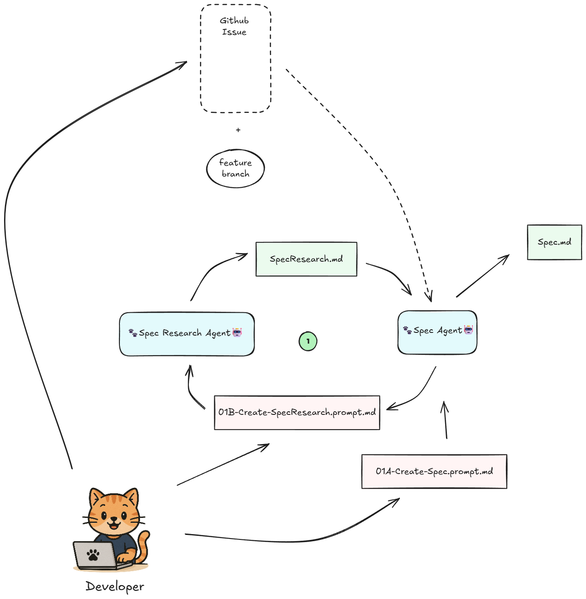

	
    <h1>Phased Agent Workflow (PAW)</h1>
    <h3>A Coding Agent Development Workflow</h3>

**Phased Agent Workflow** (PAW) is a structured, multi-phase development practice that transforms feature ideas into production-ready code using AI coding agents with human oversight at critical decision points. Built on GitHub Copilot Agent Mode in VS Code, PAW guides you from initial specification through research, planning, implementation, and documentation—with each phase producing durable artifacts that feed the next. By leveraging GitHub Pull Requests at every implementation step, PAW enables efficient human review and iteration on AI-generated code, helping you maintain high quality standards and avoid AI slop. Every phase is traceable, rewindable, and version-controlled, giving you the clarity to iterate intelligently and the confidence to restart from any layer when context drifts. PAW empowers engineers to deliver fast, high-quality contributions by focusing human attention on high-leverage decision points—refining specifications, reviewing implementation plans, and guiding code at critical junctures—while AI agents handle the systematic execution.

PAW is a system of *collaborating AI chat modes* that emulate the human software development lifecycle — each agent produces durable artifacts (specs, research docs, plans, PRs, and documentation).
The process emphasizes **clarity, traceability, and recoverability**, letting developers iterate intelligently and “rewind” if context or quality drift occurs.

### Agents

1. **Spec Agent** — turns a rough issue or work item into a refined feature specification and prompts for system research.
2. **Spec Research Agent** — documents how the current system behaves (facts only, no design).
3. **Code Research Agent** — maps relevant code areas and dependencies.
4. **Implementation Plan Agent** — writes a detailed, multi-phase plan of work.
5. **Implementation Agents** — executes plan phases, managing commits, PRs, and review loops. Split into two steps to allow agentic review and documentation improvements.
6. **Documenter Agent** — produces comprehensive technical documentation (`Docs.md`) that serves as the authoritative reference for understanding what was built, how it works, and how to use it. Updates project documentation according to project guidance.
7. **PR/Status Agent** — maintains issue/work item and PR descriptions, ensuring everything stays in sync and clear.

### Characteristics

* **Layered, iterative flow** — each artifact feeds the next.
* **Rewindable** — any phase can restart cleanly if an upstream document is wrong or incomplete.
* **Transparent** — every output is text-based and version-controlled in Git.
* **Collaborative** — humans guide, agents execute and record progress.
* **Toolchain** — Git (GitHub or Azure DevOps), VS Code, GitHub Copilot Agent Mode, markdown artifacts.

## Requirements

- VS Code with GitHub Copilot
- One of the following platform integrations (authenticated and configured):
  - **GitHub** with GitHub MCP Tools
  - **Azure DevOps** with Azure DevOps MCP Tools

## Getting Started

- Copy the .github/chatmodes into your repository's `.github/chatmodes` folder. This will make them available in VS Code's Github Copilot chat.
- Follow the workflow as described below and detailed in the [PAW Specification](paw-specification.md).

## Workflow

### Stage 1: Creating the spec

Spec and Spec Research agents collaborate to translate an issue into a measurable `Spec.md`, capture system-behavior facts in `SpecResearch.md` (with a section for optional user-provided external knowledge), and surface any remaining questions so downstream agents start with shared, testable requirements.

### Stage 2: Creating the Implementation Plan

Code Research and Implementation Plan agents map the current codebase, break the work into reviewable phases, and stage the planning branch/PR so every later change traces back to clear technical intentions.

### Stage 3: Phased implementation

Implementation and Implementation Review agents deliver each phase on its own branch, running checks, iterating on feedback, and keeping phase PRs small, auditable, and rewindable before they merge into the target branch.

The implementation process uses a two-agent workflow:

**Implementation Agent** — Makes code changes, runs automated checks, and addresses review comments by grouping related feedback into logical units and committing locally with messages that link to the comments being addressed.

**Implementation Review Agent** — Reviews the Implementation Agent's work, suggests improvements, generates docstrings and code comments, pushes changes to open Phase PRs, and posts comprehensive summary comments documenting which review comments were addressed with which commits (enabling humans to manually resolve comments in the GitHub UI).

This two-agent cycle continues until each Phase PR is approved and merged to the target branch.

### Stage 4: Documentation

The Documenter agent produces comprehensive technical documentation in `Docs.md` that explains what was built, how it works, why design decisions were made, and how to use it. It also updates project-specific documentation according to project guidance and opens a docs PR so documentation evolves in lockstep with the code.

### Stage 5: Final PR

The PR agent performs comprehensive pre-flight readiness checks (verifying all phase and docs PRs are merged, artifacts are current, and the target branch is up to date), crafts the final PR description with links to all artifacts and merged PRs, testing evidence, and deployment considerations, then creates the final PR and provides guidance on the merge process.

If review comments exist on the final PR, the same two-agent workflow from Stage 3 applies: the Implementation Agent addresses comments with local commits on the target branch, and the Implementation Review Agent verifies changes, adds improvements, pushes commits, and posts summary comments for human reviewers.

## Credits

Inspired by Dex Horthy's "Advanced Context Engineering for Coding Agents" [talk](https://youtu.be/IS_y40zY-hc?si=27dVJV7LlYDh7woA) and [writeup](https://github.com/humanlayer/advanced-context-engineering-for-coding-agents/blob/main/ace-fca.md). Original agent prompts adapted from HumanLayer's [Claude subagents and commands](https://github.com/humanlayer/humanlayer/tree/main/.claude).

Specification structure and checklist concepts were further informed by ideas from the open-source Spec Kit project (GitHub `github/spec-kit`), whose emphasis on prioritized user stories, explicit clarification markers, measurable success criteria, and structured quality checklists influenced the current spec workflow adaptation.

