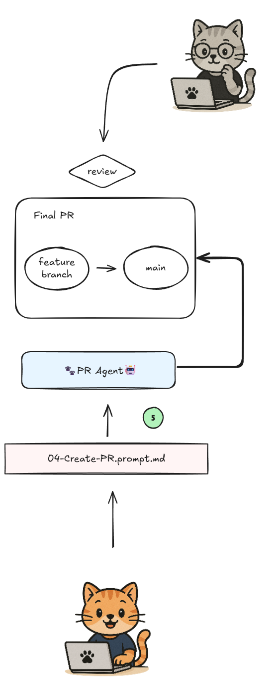

<div align="center">
	
    <h1>Phased Agent Workflow (PAW)</h1>
    <h3>A Coding Agent Development Workflow</h3>
</div>

## Try It Now

```bash
npx @paw-workflow/cli install copilot
```

This installs PAW agents and skills to your [GitHub Copilot CLI](https://github.com/github/copilot-cli). Then start a workflow:

```bash
copilot --agent PAW          # Implementation workflow
copilot --agent PAW-Review   # PR review workflow
```

Or use `/agent` inside your session to switch agents.

**Requirements**: Node.js 18+ and [GitHub Copilot CLI](https://github.com/github/copilot-cli) installed.

---

## What is PAW?

**Phased Agent Workflow** (PAW) is a structured, multi-phase development practice that transforms feature ideas into production-ready code using AI coding agents with human oversight at critical decision points. PAW guides you from initial specification through research, planning, implementation, and documentation—with each phase producing durable artifacts that feed the next. By leveraging GitHub Pull Requests at every implementation step, PAW enables efficient human review and iteration on AI-generated code, helping you maintain high quality standards and avoid AI slop. Every phase is traceable, rewindable, and version-controlled, giving you the clarity to iterate intelligently and the confidence to restart from any layer when context drifts.

PAW uses a **skills-based architecture** where compact orchestrator agents delegate to specialized activity skills. This enables efficient token usage while maintaining comprehensive workflow capabilities.

## Two Platforms

PAW works with both **GitHub Copilot CLI** (terminal) and **VS Code** (GUI):

| Platform | Installation | Best For |
|----------|--------------|----------|
| **Copilot CLI** | `npx @paw-workflow/cli install copilot` | Terminal workflows, quick iteration |
| **VS Code Extension** | Download `.vsix` from [Releases](https://github.com/lossyrob/phased-agent-workflow/releases) | IDE integration, visual workflow |

Both platforms use the same PAW agents and skills—choose based on your preferred workflow.

---

## Implementation Workflow

The **PAW agent** orchestrates the implementation workflow by loading the `paw-workflow` skill and delegating to activity skills:

**Activity Skills:**

| Skill | Purpose |
|-------|---------|
| `paw-init` | Bootstrap workflow, create WorkflowContext.md |
| `paw-spec` | Create specifications from issues/briefs |
| `paw-spec-research` | Document current system behavior |
| `paw-code-research` | Map code areas and dependencies |
| `paw-planning` | Create phased implementation plans |
| `paw-implement` | Execute plan phases, make code changes |
| `paw-impl-review` | Review changes, add docs, open PRs |
| `paw-pr` | Open final PR to main |
| `paw-status` | Check progress, recommend next steps |

**Key benefits:**
- Single orchestrator agent (~4KB) + on-demand skill loading
- Intelligent routing based on user intent
- Flexible execution—skills adapt to delegation context
- Full workflow mode support (full/minimal/custom)

### Review Workflow

The **PAW Review** agent orchestrates the review workflow using `paw-review-workflow` skill.

**How it works:**

1. The **PAW Review** agent loads the `paw-review-workflow` skill
2. The workflow skill orchestrates activity skills via subagent execution
3. Complete review runs automatically through all three stages
4. Human reviews and submits the pending review at the end

**Three stages:**
1. **Understanding (R1)** - Analyzes PR changes, researches pre-change baseline, derives specification from implementation
2. **Evaluation (R2)** - Identifies system-wide impacts, breaking changes, and gaps across correctness/safety/testing/quality with Must/Should/Could categorization
3. **Feedback Generation (R3)** - Transforms findings into structured review comments with rationale, creates GitHub pending reviews (or manual posting instructions for non-GitHub contexts)

**Key benefits:**
- Automated workflow - no manual pauses between stages
- Understand before critiquing - research pre-change system behavior first
- Comprehensive findings - generate all issues, human filters based on context
- Evidence-based feedback - every finding includes file:line references and rationale
- Cross-repository support - review related PRs across multiple repositories together
- Full human control - nothing posted automatically, edit/delete comments before submitting

See [Review Workflow Documentation](docs/specification/review.md) for detailed usage guide.

### Characteristics

* **Layered, iterative flow** — each artifact feeds the next.
* **Rewindable** — any phase can restart cleanly if an upstream document is wrong or incomplete.
* **Transparent** — every output is text-based and version-controlled in Git.
* **Collaborative** — humans guide, agents execute and record progress.
* **Toolchain** — Git (GitHub or Azure DevOps), VS Code, GitHub Copilot Agent Mode, markdown artifacts.

## Two Workflows: Implementation and Review

PAW provides two complementary workflows:

### PAW Implementation Workflow

The core workflow for building features: turns GitHub Issues into production-ready code through structured phases (Specification → Research → Planning → Implementation → Documentation → Final PR). Each phase produces durable artifacts that feed the next, with human oversight at critical decision points.

**Use for**: Building new features, enhancements, refactors, and bug fixes.

### PAW Review Workflow

A structured three-stage process for thorough code review using a **skills-based architecture**: systematically understands PR changes, evaluates impacts and gaps, and generates comprehensive evidence-based feedback with full human control over what gets posted.

**Use for**: Reviewing any pull request—especially valuable for large or poorly-documented PRs.

**Invocation:** `/paw-review <PR-number-or-URL>`

**Three stages** (automated via skill orchestration):
1. **Understanding (R1)** - Analyzes PR metadata, researches pre-change baseline, and derives specification from implementation
2. **Evaluation (R2)** - Identifies system-wide impacts, breaking changes, and gaps across correctness/safety/testing/quality with Must/Should/Could categorization
3. **Feedback Generation (R3)** - Transforms findings into structured review comments with rationale, creates GitHub pending reviews (or manual posting instructions for non-GitHub contexts)

**Key benefits**:
- Automated workflow - no manual pauses between stages
- Understand before critiquing - research pre-change system behavior first
- Comprehensive findings - generate all issues, human filters based on context
- Evidence-based feedback - every finding includes file:line references and rationale
- Cross-repository support - review related PRs across multiple repositories together
- Full human control - nothing posted automatically, edit/delete comments before submitting

See [PAW Review Workflow Documentation](docs/specification/review.md) for detailed usage guide.

## Requirements

### For Copilot CLI (Recommended)

- Node.js 18.0.0 or later
- [GitHub Copilot CLI](https://docs.github.com/en/copilot/using-github-copilot/using-github-copilot-in-the-command-line)

### For VS Code Extension

- VS Code with GitHub Copilot
- One of the following platform integrations (authenticated and configured):
  - **GitHub** with GitHub MCP Tools
  - **Azure DevOps** with Azure DevOps MCP Tools

## Getting Started

### Using the CLI (Recommended)

```bash
# Install PAW to Copilot CLI
npx @paw-workflow/cli install copilot

# Manage your installation
npx @paw-workflow/cli list      # Show installed version
npx @paw-workflow/cli upgrade   # Check for updates
npx @paw-workflow/cli uninstall # Remove PAW
```

Files are installed to:
- `~/.copilot/agents/` - Agent files
- `~/.copilot/skills/` - Skill directories

Then use PAW in any `copilot` session:
```bash
copilot
# Use /agent to select PAW or PAW Review
```

### Using VS Code Extension

1. **Download** the latest `.vsix` from the [Releases page](https://github.com/lossyrob/phased-agent-workflow/releases)
2. **Install** in VS Code: `Extensions: Install from VSIX...` from the Command Palette ([detailed instructions](https://code.visualstudio.com/docs/editor/extension-marketplace#_install-from-a-vsix))
3. **Configure MCP Server** (Recommended): Set up the [GitHub MCP Server](https://github.com/github/github-mcp-server) or [Azure DevOps MCP Server](https://github.com/microsoft/azure-devops-mcp) in VS Code for optimal agent integration
4. **Open** the Command Palette (`Ctrl+Shift+P` / `Cmd+Shift+P`) and type `PAW` to see available commands
5. **Start new work** with `PAW: New PAW Workflow`
6. **Get help** anytime with `PAW: Get Work Status`

For manual agent installation, copy the `agents/` folder contents to VS Code's global prompts directory:
- **Windows**: `%APPDATA%\Code\User\prompts`
- **macOS**: `~/Library/Application Support/Code/User/prompts`
- **Linux**: `~/.config/Code/User/prompts`

Follow the workflow as described below and detailed in the [PAW Specification](paw-specification.md).

### VS Code Extension Features

The **PAW Workflow Extension** automates PAW agent installation and work item initialization.

- **Automatic agent installation**: PAW agents install to VS Code prompts directory on first activation and appear in GitHub Copilot Chat
- **New PAW Workflow command**: One command to create complete `.paw/work/<feature-slug>/` directory structure
  - Creates `.paw/work/<feature-slug>/` with WorkflowContext.md
  - Creates and checks out git branch
  - Opens WorkflowContext.md for immediate editing
  - Navigate stages using simple commands; prompt files generated on-demand when customization needed

**Usage:**

1. Open a git repository in VS Code
2. Press `Cmd+Shift+P` (Mac) or `Ctrl+Shift+P` (Windows/Linux)
3. Type "PAW: New PAW Workflow"
4. Enter issue or work item URL (optional - press Enter to skip)
5. Enter branch name (optional - press Enter to auto-derive from issue or description)
6. Watch as your workflow structure is created automatically

**Workflow Status:** At any time, run "PAW: Get Work Status" to check progress and get next-step recommendations.

**Artifact Tracking:** PAW commits workflow artifacts to git by default. Select "Don't Track" at initialization, or run "PAW: Stop Tracking Artifacts" mid-workflow to exclude artifacts from commits.

**Customization:** Use VS Code's standard `copilot-instructions.md` (project-level) or `AGENTS.md` files rather than PAW-specific instructions.

**Requirements:** Git repository and GitHub Copilot extension installed and active.

The extension streamlines initialization but is not required—you can create the directory structure manually following the [PAW Specification](paw-specification.md).

**Uninstalling:** After uninstalling the extension, use the configure agents UI in GitHub Copilot Chat to remove the PAW agents.

## Workflow Modes

PAW supports three workflow modes—**Full**, **Minimal**, and **Custom**—to match your task scope and development style. Each mode determines which workflow stages are included and how work is reviewed (via intermediate PRs or locally on a single branch).

**Quick Overview:**
- **Full Mode**: All stages from Spec through Documentation. Supports both PRs (intermediate reviews) and Local (single branch) strategies.
- **Minimal Mode**: Core stages only (Code Research → Implementation → Final PR). Enforces Local strategy for simplicity.
- **Custom Mode**: User-defined stages and review strategy based on your specific workflow needs.

When using the VS Code extension's `PAW: New PAW Workflow` command, you'll select your workflow mode and review strategy during initialization. Your selections are stored in `WorkflowContext.md` and guide all agents throughout the workflow.

For detailed information about each mode, when to use them, and how review strategies work, see the [PAW Specification](paw-specification.md#workflow-modes).

## Workflow Handoffs

PAW supports intelligent stage navigation through three handoff modes—**Manual**, **Semi-Auto**, and **Auto**—to adapt to your experience level and the nature of your work.

### Handoff Modes

**Manual Mode** (Default)
- Full control over stage transitions
- Agents present next-step options at completion
- You explicitly command each transition
- Best for learning PAW or when you want to review and decide at each step

**Semi-Auto Mode**
- Thoughtful automation at research and review transitions
- Automatic handoffs at designated points (Spec → Research → Spec, Phase → Review)
- Pauses at key decision points (after Planning, before Implementation)
- Best for experienced users who want speed with control at critical moments

**Auto Mode**
- Full automation through all workflow stages
- Agents chain automatically with only tool approval interactions
- Requires local review strategy (incompatible with intermediate PRs)
- Best for routine work where you trust agents to complete the workflow

### Stage Transition Commands

After completing a stage, agents present contextual next-step options. Use simple commands to transition:

- `research` or `start research` → Move to Spec Research Agent
- `code` or `code research` → Move to Code Research Agent
- `plan` → Move to Implementation Plan Agent
- `implement Phase 2` → Start Implementation Agent for Phase 2
- `review` → Move to Implementation Review Agent
- `docs` → Move to Documenter Agent
- `pr` → Move to PR Agent
- `status` → Check workflow status

**Important:** Commands starting with specific keywords (like `feedback:`, `address comments`, `check pr`) are recognized as handoff triggers. Agents will transition to the appropriate stage rather than acting on the command themselves. For example, saying `feedback: add error handling` in local strategy hands off to the Implementation Agent instead of having the current agent make the change.

### The Continue Command

When agents complete their work, they present a handoff message with "Next Steps" listing available commands. Saying `continue` proceeds to the **first option** in that list (the recommended default action). The agent's guidance line explicitly states what `continue` will do:

```
You can ask me to generate a prompt file for the next stage, ask for 'status' or 'help', or say 'continue' to proceed to review.
```

This makes continue behavior predictable—you always know which agent will be invoked next.

### Inline Instructions

Customize agent behavior without creating prompt files by providing inline instructions:

```
implement Phase 2 but add rate limiting
continue but focus on error handling
research but skip external dependencies
```

The inline instruction is passed directly to the target agent alongside the Work ID, allowing for quick customization without filesystem management.

For detailed information about handoff modes, transition patterns, and customization options, see the [PAW Specification](paw-specification.md#workflow-handoffs).

## Workflow


### Stage 1: Creating the spec

Spec and Spec Research agents collaborate to translate an issue into a measurable `Spec.md`, capture system-behavior facts in `SpecResearch.md` (with a section for optional user-provided external knowledge), and surface any remaining questions so downstream agents start with shared, testable requirements. Each spec includes Overview and Objectives narrative sections that provide big-picture context before diving into detailed user stories and requirements.


### Stage 2: Creating the Implementation Plan

Code Research and Implementation Plan agents map the current codebase, break the work into reviewable phases, and stage the planning branch/PR so every later change traces back to clear technical intentions.


### Stage 3: Phased implementation

Implementation and Implementation Review agents deliver each phase on its own branch, running checks, iterating on feedback, and keeping phase PRs small, auditable, and rewindable before they merge into the target branch.

The implementation process uses a two-agent workflow:

**Implementation Agent** — Makes code changes, runs automated checks, and addresses review comments by grouping related feedback into logical units and committing locally with messages that link to the comments being addressed.

**Implementation Review Agent** — Reviews the Implementation Agent's work, suggests improvements, generates docstrings and code comments, pushes changes to open Phase PRs, and posts comprehensive summary comments documenting which review comments were addressed with which commits (enabling humans to manually resolve comments in the GitHub UI).

This two-agent cycle continues until each Phase PR is approved and merged to the target branch.


### Stage 4: Documentation

The Documenter agent produces comprehensive technical documentation in `Docs.md` that explains what was built, how it works, why design decisions were made, and how to use it. It also updates project-specific documentation according to project guidance and opens a docs PR so documentation evolves in lockstep with the code.


### Stage 5: Final PR

The PR agent performs comprehensive pre-flight readiness checks (verifying all phase and docs PRs are merged, artifacts are current, and the target branch is up to date), crafts the final PR description with links to all artifacts and merged PRs, testing evidence, and deployment considerations, then creates the final PR and provides guidance on the merge process.

If review comments exist on the final PR, the same two-agent workflow from Stage 3 applies: the Implementation Agent addresses comments with local commits on the target branch, and the Implementation Review Agent verifies changes, adds improvements, pushes commits, and posts summary comments for human reviewers.



## Credits

Inspired by Dex Horthy's "Advanced Context Engineering for Coding Agents" [talk](https://youtu.be/IS_y40zY-hc?si=27dVJV7LlYDh7woA) and [writeup](https://github.com/humanlayer/advanced-context-engineering-for-coding-agents/blob/main/ace-fca.md). Original agent prompts adapted from HumanLayer's [Claude subagents and commands](https://github.com/humanlayer/humanlayer/tree/main/.claude).

Specification structure and checklist concepts were further informed by ideas from the open-source Spec Kit project (GitHub `github/spec-kit`), whose emphasis on prioritized user stories, explicit clarification markers, measurable success criteria, and structured quality checklists influenced the current spec workflow adaptation.

