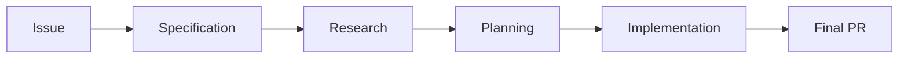
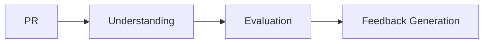

# Two Workflows: Implementation and Review

PAW provides two complementary workflows for different development scenarios:

1. **Implementation Workflow** — Building new features from scratch
2. **Review Workflow** — Thoroughly reviewing existing pull requests

Both workflows use a **skills-based architecture** with compact orchestrator agents that delegate to specialized activity skills.

## PAW Implementation Workflow

The core workflow for building features: turns GitHub Issues into production-ready code through structured phases.

### What It Does

The Implementation Workflow transforms feature ideas into production-ready code by moving through staged, reviewable milestones with clear artifacts:

- **Specification** → Turn rough ideas into testable requirements
- **Research** → Understand the codebase and system behavior  
- **Planning** → Create detailed implementation plans with phases
- **Implementation** → Execute plans with automated verification (includes documentation when appropriate)
- **Final PR** → Open the pull request to main

### Architecture

The **PAW agent** orchestrates the workflow by:

1. Loading the `paw-workflow` skill for guidance
2. Discovering available skills via `paw_get_skills`
3. Delegating activities to specialized skills (e.g., `paw-spec`, `paw-planning`, `paw-implement`)
4. Applying Review Policy for pause decisions at artifact boundaries

### When to Use It

- Building new features, enhancements, or refactors
- Bug fixes (especially complex ones)
- Any work that benefits from structured phases and clear artifacts
- Projects where traceability and documentation are important

### Key Benefits

- **Traceable** — Every stage produces durable artifacts committed to Git
- **Rewindable** — Any stage can restart if upstream documents need fixes
- **Transparent** — All outputs are text-based and version-controlled
- **Collaborative** — Humans guide, agents execute and record progress

## PAW Review Workflow

A structured three-stage process for thorough code review: systematically understands PR changes, evaluates impacts and gaps, and generates comprehensive evidence-based feedback.

### What It Does

The Review Workflow helps you thoroughly review any pull request through three stages:

1. **Understanding (R1)** — Analyze PR metadata, generate baseline research prompts, and derive specification from implementation
2. **Evaluation (R2)** — Identify system-wide impacts, breaking changes, and gaps across correctness/safety/testing/quality with Must/Should/Could categorization
3. **Feedback Generation (R3)** — Transform findings into structured review comments with rationale, create GitHub pending reviews

### When to Use It

- Reviewing any pull request—especially large or poorly-documented PRs
- When you want comprehensive, evidence-based feedback
- When you need to understand complex changes before providing feedback
- When thorough review is important for quality

### Key Benefits

- **Understand before critiquing** — Research pre-change system behavior first
- **Comprehensive findings** — Generate all issues; human filters based on context
- **Evidence-based feedback** — Every finding includes file:line references and rationale
- **Full human control** — Nothing posted automatically; edit/delete comments before submitting

## Choosing Between Workflows

| Scenario | Use This Workflow |
|----------|-------------------|
| Building a new feature | Implementation |
| Fixing a bug | Implementation |
| Refactoring code | Implementation |
| Reviewing someone else's PR | Review |
| Doing a thorough code review | Review |
| Understanding complex changes | Review |

## Workflow Characteristics

Both workflows share PAW's core principles:

| Characteristic | Description |
|----------------|-------------|
| **Layered, iterative flow** | Each artifact feeds the next |
| **Rewindable** | Any phase can restart cleanly if an upstream document is wrong |
| **Transparent** | Every output is text-based and version-controlled in Git |
| **Collaborative** | Humans guide, agents execute and record progress |
| **Human-in-the-loop** | Humans approve specs/plans, review PRs, and decide when to rewind |

## Next Steps

- [Workflow Modes](workflow-modes.md) — Configure Full, Minimal, or Custom modes for implementation
- [Implementation Workflow Specification](../specification/implementation.md) — Deep dive into implementation stages
- [Review Workflow Specification](../specification/review.md) — Deep dive into review stages
