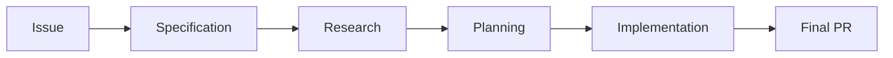
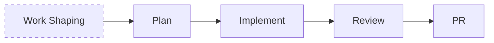
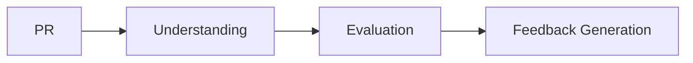

# Workflows

PAW provides three workflows for different development scenarios:

1. **Implementation Workflow** — Building new features through structured phases
2. **PAW Lite** — Lightweight workflow for frontier models that reason well in the moment
3. **Review Workflow** — Thoroughly reviewing existing pull requests

All workflows use a **skills-based architecture** with compact orchestrator agents that delegate to specialized activity skills.

## PAW Implementation Workflow

The core workflow for building features: turns GitHub Issues into production-ready code through structured phases.

```mermaid
graph LR
    A[Issue] --> B[Specification]
    B --> C[Research]
    C --> D[Planning]
    D --> E[Implementation]
    E --> F[Final PR]
```

### What It Does

The Implementation Workflow transforms feature ideas into production-ready code by moving through staged, reviewable milestones with clear artifacts:

- **Specification** → Turn rough ideas into testable requirements
- **Research** → Understand the codebase and system behavior  
- **Planning** → Create detailed implementation plans with phases
- **Implementation** → Execute plans with automated verification (includes documentation when appropriate)
- **Final PR** → Open the pull request to main

### Architecture

The **PAW agent** orchestrates the workflow by:

1. Loading the `paw-workflow` skill for guidance
2. Discovering available skills via `paw_get_skills`
3. Delegating activities to specialized skills (e.g., `paw-spec`, `paw-planning`, `paw-implement`)
4. Applying Review Policy for pause decisions at artifact boundaries

### When to Use It

- Building new features, enhancements, or refactors
- Bug fixes (especially complex ones)
- Any work that benefits from structured phases and clear artifacts
- Projects where traceability and documentation are important

### Key Benefits

- **Traceable** — Every stage produces durable artifacts committed to Git
- **Rewindable** — Any stage can restart if upstream documents need fixes
- **Transparent** — All outputs are text-based and version-controlled
- **Collaborative** — Humans guide, agents execute and record progress

## PAW Lite

A lightweight workflow that keeps PAW's most valuable components — work shaping, SoT review, git discipline, artifact lifecycle — while replacing the rigid spec→plan→phased-implement pipeline with a flow that trusts frontier models to make implementation decisions in the moment.

```mermaid
graph LR
    A[Work Shaping] --> B[Plan]
    B --> C[Implement]
    C --> D[Review]
    D --> E[PR]
    style A stroke-dasharray: 5 5
```

### What It Does

PAW Lite strips the multi-stage pipeline down to what matters:

- **Work Shaping** (optional) → Clarify vague ideas through interactive Q&A
- **Plan** → Lightweight plan with approach summary and work items (no rigid spec)
- **Implement** → Fleet-style parallel dispatch using SQL todos and `task` subagents
- **Review** → Configurable: single-model, multi-model, or full Society of Thought
- **PR** → Final pull request with artifact cleanup

### When to Use It

- Tasks where frontier models can reason about implementation without a formal spec
- Bug fixes and small-to-medium features where the goal is clear
- When you want PAW's review quality and git discipline without the overhead
- When you trust the model to make good implementation decisions given a light plan

### Key Differences from Full PAW

| Aspect | Full PAW | PAW Lite |
|--------|----------|----------|
| Specification | Formal Spec.md with requirements | Skipped (or captured in work shaping) |
| Planning | Detailed phased ImplementationPlan.md | Light Plan.md with approach and work items |
| Implementation | Sequential phases with per-phase review | Fleet-style parallel dispatch via SQL todos |
| Review | Configurable per-phase + final | Single review gate (configurable mode) |
| Best for | Complex features, formal requirements | Clear tasks, frontier model capabilities |

### Configuration

PAW Lite uses `custom` workflow mode with lighter defaults:

| Field | Default |
|-------|---------|
| Workflow Mode | `custom` |
| Review Strategy | `local` |
| Review Policy | `final-pr-only` |
| Artifact Lifecycle | `commit-and-clean` |

## PAW Review Workflow

A structured three-stage process for thorough code review: systematically understands PR changes, evaluates impacts and gaps, and generates comprehensive evidence-based feedback.

```mermaid
graph LR
    A[PR] --> B[Understanding]
    B --> C[Evaluation]
    C --> D[Feedback Generation]
```

### What It Does

The Review Workflow helps you thoroughly review any pull request through three stages:

1. **Understanding (R1)** — Analyze PR metadata, generate baseline research prompts, and derive specification from implementation
2. **Evaluation (R2)** — Identify system-wide impacts, breaking changes, and gaps across correctness/safety/testing/quality with Must/Should/Could categorization
3. **Feedback Generation (R3)** — Transform findings into structured review comments with rationale, create GitHub pending reviews

### When to Use It

- Reviewing any pull request—especially large or poorly-documented PRs
- When you want comprehensive, evidence-based feedback
- When you need to understand complex changes before providing feedback
- When thorough review is important for quality

### Key Benefits

- **Understand before critiquing** — Research pre-change system behavior first
- **Comprehensive findings** — Generate all issues; human filters based on context
- **Evidence-based feedback** — Every finding includes file:line references and rationale
- **Full human control** — Nothing posted automatically; edit/delete comments before submitting

## Choosing Between Workflows

| Scenario | Use This Workflow |
|----------|-------------------|
| Large feature with formal requirements | Implementation |
| Complex refactoring needing phased review | Implementation |
| Clear task, frontier model available | PAW Lite |
| Bug fix or small-to-medium feature | PAW Lite |
| Reviewing someone else's PR | Review |
| Doing a thorough code review | Review |

## Workflow Characteristics

All workflows share PAW's core principles:

| Characteristic | Description |
|----------------|-------------|
| **Layered, iterative flow** | Each artifact feeds the next |
| **Rewindable** | Any phase can restart cleanly if an upstream document is wrong |
| **Transparent** | Every output is text-based and version-controlled in Git |
| **Collaborative** | Humans guide, agents execute and record progress |
| **Human-in-the-loop** | Humans approve specs/plans, review PRs, and decide when to rewind |

## Next Steps

- [Workflow Modes](workflow-modes.md) — Configure Full, Minimal, or Custom modes for implementation
- [Society-of-Thought Review](society-of-thought-review.md) — Multi-perspective review engine used by PAW Lite's review stage
- [Implementation Workflow Specification](../specification/implementation.md) — Deep dive into implementation stages
- [Review Workflow Specification](../specification/review.md) — Deep dive into review stages
