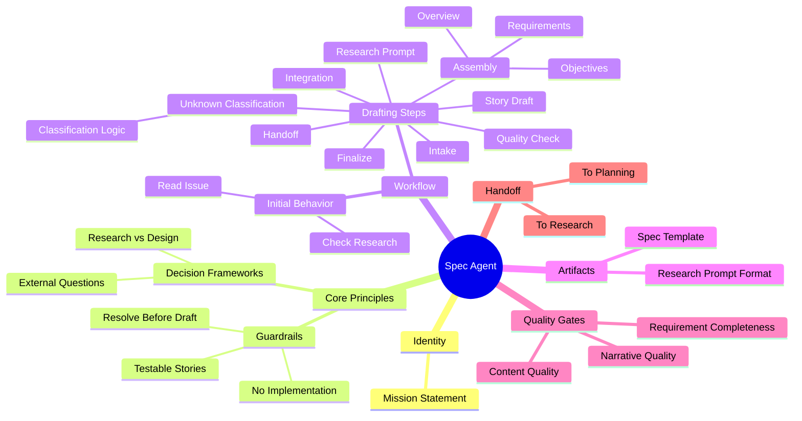

# Context Management Meta-Structure Analysis

## The Problem

Agent prompts contain too much interleaved content to refactor into modular skills effectively. We need a meta-structure that:
- Identifies atomic units of knowledge/instruction
- Represents relationships between units
- Enables context-aware filtering and composition
- Supports skill construction through assembly

## Terminology Candidates

For the atomic unit (leaf annotations):

| Term | Connotation | Fit |
|------|-------------|-----|
| **Grain** | Smallest useful particle, aggregates naturally | ✓ Good |
| **Atom** | Indivisible, fundamental building block | ✓ Good |
| **Fragment** | Broken piece, incomplete feeling | Weak |
| **Nugget** | Valuable small piece of knowledge | ✓ Good |
| **Cell** | Self-contained unit, biological/compositional | ✓ Good |
| **Shard** | Piece of something larger | Weak |
| **Morsel** | Small digestible piece | Decent |
| **Facet** | One aspect/face of a concept | Decent |

**Recommendation**: **Grain** — natural metaphor for aggregation, implies texture/substance, works with "granularity" as a concept.

For collections/sets:

| Term | Relationship to Grain |
|------|----------------------|
| **Cluster** | Natural grouping of related grains |
| **Bundle** | Intentional packaging of grains for use |
| **Facet** | Perspective that selects relevant grains |
| **Aspect** | View/slice through the grain space |
| **Domain** | Bounded context containing grains |

## Proposed Structure

```
┌─────────────────────────────────────────────────────────────────┐
│                         SKILL                                   │
│  (Rendered markdown, the final artifact)                        │
├─────────────────────────────────────────────────────────────────┤
│                                                                 │
│   ┌─────────────┐    ┌─────────────┐    ┌─────────────┐        │
│   │   Bundle    │    │   Bundle    │    │   Bundle    │        │
│   │  "guardrails"│    │  "workflow" │    │  "handoff"  │        │
│   └──────┬──────┘    └──────┬──────┘    └──────┬──────┘        │
│          │                  │                  │                │
│          ▼                  ▼                  ▼                │
│   ┌────────────────────────────────────────────────────┐       │
│   │              GRAIN GRAPH                            │       │
│   │                                                     │       │
│   │   (guardrail:no-impl)──┐                           │       │
│   │   (guardrail:testable) │                           │       │
│   │   (guardrail:resolve)──┴──▶[requires]──▶(workflow:step3)   │
│   │                                                     │       │
│   │   (workflow:step1)──[precedes]──▶(workflow:step2)  │       │
│   │   (workflow:step3)──[contains]──▶(classification)  │       │
│   │                                                     │       │
│   │   (handoff:research)──[depends]──▶(artifact:prompt)│       │
│   └────────────────────────────────────────────────────┘       │
│                                                                 │
└─────────────────────────────────────────────────────────────────┘
```

## Graph Model

### Nodes (Grains)

```yaml
grain:
  id: "guardrail:no-implementation-details"
  type: guardrail          # From annotation taxonomy
  content: |
    Never include implementation details (no tech stack, file paths, 
    library names, code snippets, API signatures).
  tags: [spec, behavioral, prohibition]
  weight: 1.0              # Importance/priority
```

### Edges (Relationships)

| Edge Type | Semantics | Example |
|-----------|-----------|---------|
| `requires` | A needs B to be present | guardrail → workflow-step |
| `precedes` | A comes before B in output | step1 → step2 |
| `contains` | A is parent of B | workflow-step → classification-logic |
| `conflicts` | A and B are mutually exclusive | mode:full ↔ mode:minimal |
| `enriches` | A provides context for B | example → guardrail |
| `implements` | A is concrete form of B | artifact-format → requirement |

### Bundles (Selection Criteria)

```yaml
bundle:
  id: "spec-guardrails"
  description: "Core behavioral constraints for specification work"
  selector:
    type: guardrail
    tags: [spec]
  ordering: weight_desc
  inject_at: "## Core Principles"  # Target location in skill template
```

## Composition Process

```
1. SKILL TEMPLATE (skeleton with injection points)
       │
       ▼
2. BUNDLE RESOLUTION (select grains per bundle criteria)
       │
       ▼
3. GRAIN FILTERING (context-aware: workflow mode, stage, etc.)
       │
       ▼
4. EDGE TRAVERSAL (include required dependencies)
       │
       ▼
5. ORDERING (topological sort + weight)
       │
       ▼
6. RENDERING (grains → markdown sections)
       │
       ▼
7. SKILL OUTPUT (complete agent prompt)
```

## Context-Aware Filtering

The graph enables runtime filtering based on:

```yaml
context:
  workflow_mode: minimal      # → exclude grains tagged "full-only"
  stage: implementation       # → prioritize impl-related grains
  has_research: false         # → include research-prompt grains
  review_strategy: prs        # → include PR-related handoff grains
```

Filter expression example:
```
SELECT grains 
WHERE bundle = "guardrails"
  AND (tags CONTAINS context.stage OR tags CONTAINS "universal")
  AND NOT (tags CONTAINS "full-only" AND context.workflow_mode = "minimal")
ORDER BY weight DESC
```

## Benefits

1. **Deduplication**: Shared grains across skills (guardrails, common patterns)
2. **Consistency**: Single source of truth for each instruction
3. **Flexibility**: Runtime composition based on context
4. **Traceability**: Graph edges explain why content is included
5. **Testability**: Individual grains can be validated
6. **Versioning**: Grain-level change tracking

## Potential Data Format

```yaml
# grains/guardrails/no-implementation.grain.yaml
id: guardrail:no-implementation
type: guardrail
version: 1.0.0
content: |
  **User value focus**: Describe WHAT & WHY, never implementation details 
  (no tech stack, file paths, library names, code snippets, API signatures, 
  class/interface definitions).
tags: [spec, behavioral, prohibition, universal]
weight: 0.95
edges:
  - type: enriches
    target: artifact:spec-template
  - type: requires
    target: workflow:quality-check
```

## Open Questions

1. **Grain granularity**: How small? Single sentence? Paragraph? Logical unit?
2. **Edge semantics**: What relationship types are necessary and sufficient?
3. **Bundle vs. Facet**: Static groupings or dynamic views?
4. **Rendering order**: Pure topological sort or allow explicit sequencing?
5. **Inheritance**: Can grains extend/override other grains?
6. **Validation**: How to ensure graph consistency and completeness?

## Critical Assessment: Why This Might Be Overengineered

### The Core Problem With This Approach

**You're building a content management system when you might just need better files.**

The grain/graph model introduces significant complexity:

1. **Indirection tax**: Every edit now requires understanding the graph topology, not just the prose. Debugging "why did this instruction appear?" becomes a graph traversal problem.

2. **Premature abstraction**: We don't yet know which grains are actually shared. The assumption that guardrails are reusable across agents may be false—context often makes "the same instruction" mean different things.

3. **Composition is hard**: The rendering pipeline (template → bundle → filter → traverse → order → render) has 6 failure points. Each step adds latency to iteration. When you tweak a grain, what breaks?

4. **Maintenance burden**: Now you maintain grains, edges, bundles, selectors, templates, AND the composition tooling. That's 5x the surface area of "one markdown file per agent."

5. **Testing complexity**: How do you test that a composed prompt behaves correctly? You can't diff against a known-good file because the output is generated.

### What We're Actually Trying to Solve

Be honest about the real problems:

- **Duplication**: Some instructions repeat across agents
- **Consistency**: Updates to shared concepts require touching multiple files
- **Context bloat**: Agents get too much irrelevant instruction for their mode

### Simpler Alternatives

**Option A: Component Files + Include**

```markdown
# Agent Prompt

{{include components/guardrails-behavioral.md}}
{{include components/handoff-pattern.md}}

## Agent-Specific Content
...
```

Tooling: One script that resolves includes. Done.

Pros: Trivial to understand, files are readable standalone, git diffs work.
Cons: Less dynamic filtering, includes are all-or-nothing.

**Option B: Templated Markdown with Conditionals**

```markdown
# Agent Prompt


{{include guardrails-full.md}}

{{include guardrails-minimal.md}}

```

Tooling: Jinja2 or similar. Well-understood, battle-tested.

Pros: Dynamic composition, familiar syntax, existing ecosystem.
Cons: Still need to maintain condition logic, templates can get messy.

**Option C: Just Write Better Agents**

Accept that each agent is a document. Optimize for:
- Reading: A human can understand the whole thing in one pass
- Editing: Changes are local, obvious, diffable
- Debugging: When agent misbehaves, the cause is in the file

If duplication exists, manage it through discipline and periodic review, not infrastructure.

### When Grain/Graph IS Appropriate

This architecture makes sense if:

1. You have **50+ agents** with significant structural overlap
2. You need **runtime composition** (user-configurable prompts)
3. You're building a **platform** where others define agents
4. You have dedicated **tooling engineering** capacity

For PAW with ~15 agents maintained by a small team? Probably not.

### The Middle Path

If you still want structure without the full graph:

1. **Annotate** prompts (what you've done)
2. **Extract** obviously shared components to include files
3. **Stop there** until pain forces more abstraction
4. **Revisit** after 6 months: what actually got shared? What broke?

The annotations you have now are valuable for understanding structure. They don't require a graph database to be useful.

### The Real Question

> "Am I building this because it solves a problem I have, or because it's an interesting problem to solve?"

If you're spending more time on the meta-structure than on agent behavior, recalibrate.

---

## Critical Assessment Response

### Reframing the Problem

The critical assessment above mischaracterizes the goal. This isn't about deduplication or even runtime composition. The actual problems are:

1. **Comprehension burden**: Agent files are opaque. Reading one requires mentally summarizing each section, then holding those summaries to understand how they relate. This cognitive load makes it hard to reason about completeness or redundancy.

2. **Authoring difficulty**: Without understanding the structure, writing new agents means copying existing ones and hoping you didn't miss something critical or include something irrelevant.

3. **Cross-project applicability**: This isn't about PAW specifically—it's about developing intuition and tooling for agent/skill composition across many projects and systems.

The meta-structure is a **comprehension and authoring tool**, not a content management system.

### Reassessing With This Frame

**Potential Upsides**

1. **Structural vocabulary**: The annotation taxonomy (`<guardrail>`, `<workflow-step>`, `<handoff-instruction>`) gives names to things. Naming enables discussion, comparison, and pattern recognition across agents.

2. **Explicit purpose**: When each section declares what it IS (via annotation), you stop asking "why is this here?" The answer is encoded in the structure.

3. **Gap detection**: If you know the expected structure (agent-identity, core-principles, workflow, artifacts, quality-gates, handoff), you can mechanically check what's missing. "This agent has no quality-gate—is that intentional?"

4. **Template generation**: Annotated structure becomes a skeleton for new agents. Instead of copying prose, you instantiate the pattern and fill in the specifics.

5. **Cross-project learning**: A consistent meta-structure lets you compare agents across projects. "Project A's research agent has 9 guardrails; Project B's has 3. What's different about their contexts?"

**Downsides, Reconsidered**

1. **Annotation overhead**: You still have to annotate. If the structure isn't obviously valuable during annotation, you're doing busywork.

2. **False structure**: Forcing content into a taxonomy can obscure what's actually happening. Not everything is a guardrail. Categories that don't fit the content create more confusion, not less.

3. **Premature crystallization**: Defining THE structure implies you know what good agents look like. If you're still learning, a fixed taxonomy may calcify bad patterns.

4. **Transfer risk**: A structure that works for PAW's phased workflow may not transfer to other agent architectures. You might be building a PAW-specific tool while thinking you're building a general one.

**Better Alternatives for Comprehension**

If the goal is understanding and authoring (not composition infrastructure), consider:

**Alternative A: Annotations as Documentation, Not Infrastructure**

Keep the XML annotations exactly as you have them. Use them for:
- Human reading (collapsible sections in a viewer)
- Generating summaries ("This agent has: 9 guardrails, 7 workflow steps, 2 artifact formats")
- Linting ("Warning: no handoff-instruction found")

Don't build composition tooling. The value is in the annotations themselves.

**Alternative B: Structural Patterns as Checklists**

Distill the meta-structure into a checklist for authoring:

```
Agent Authorship Checklist:
□ Identity: Who is this agent? One-sentence mission.
□ Principles: What rules always apply? (guardrails)
□ Workflow: What steps does it follow? In what order?
□ Artifacts: What does it produce? What format?
□ Quality: How do we know output is good?
□ Handoff: What happens when it's done? To whom?
```

This gives you the comprehension benefit without building systems.

**Alternative C: Visual Structure Map**

Generate a visual summary from annotations:

```
┌─────────────────────────────────────────┐
│ SPEC AGENT                              │
├───────────────┬─────────────────────────┤
│ Guardrails: 9 │ Steps: 9                │
│ Examples: 4   │ Artifacts: 2            │
│ Quality: 2    │ Handoff paths: 2        │
└───────────────┴─────────────────────────┘
```

This surfaces structure without requiring you to hold it all mentally.

### Guidance

The instinct to find structure is correct. The question is how much infrastructure to build around it.

**My recommendation**: 

1. Finish annotating a few more agents with the current taxonomy
2. See what patterns actually recur vs. what's agent-specific
3. Build the simplest tool that reveals those patterns (probably: summary generator, checklist extractor)
4. Only build composition machinery if you find yourself manually doing composition repeatedly

The annotations are the insight. The graph is speculation about how you'll use that insight. Earn the graph by discovering you need it.

---

## Research Perspective: Structure as a Lens

*Response from Principal Researcher / Applied Scientist*

### What You're Actually Building

Let me reframe what I'm hearing. You're not building a composition system. You're building a **structural analysis framework**—a way to see prompts as structured objects rather than walls of text.

The workflow you've outlined:
1. **Annotate** via LLM-driven process (cheap, scalable)
2. **Visualize** via mermaid mindmap (immediate comprehension)
3. **Template later** if deduplication becomes a real problem

This is a research tool, not production infrastructure. The output is *understanding*, not *software*.

### Why Structure Matters for Prompts

There's an interesting parallel to program analysis here. We don't just read code—we build ASTs, call graphs, dependency trees. These representations reveal properties invisible in the source text:
- What depends on what?
- What's reachable from where?
- What's the shape of this thing?

Prompts are programs for LLMs. They have structure even when that structure isn't explicit. Your annotation taxonomy is essentially defining a grammar—a way to parse unstructured prose into typed nodes.

Once you have typed nodes, questions become answerable:
- "Show me all the guardrails across my agent suite"
- "Which agents have handoff instructions? Which don't?"
- "What's the average workflow depth? Are some agents doing too much?"

### The Annotation-First Approach

The LLM-driven annotation process is the key insight. You're using one LLM to analyze prompts that will be consumed by another LLM. This is meta-level prompt engineering.

**What makes this tractable:**
- The taxonomy is small (your ~30 tag types)
- The task is classification, not generation
- Errors are visible and correctable (you can review annotations)
- The fix_xml_nesting.py script handles mechanical concerns

**What to explore:**
- Can a smaller/cheaper model do the annotation reliably?
- What's the annotation error rate? Does it matter?
- Can you annotate incrementally (new sections only)?

### Visualization as the Primary Interface

The mermaid mindmap isn't a nice-to-have—it's the product. When you look at a mindmap of an agent, you're seeing:
- **Breadth**: How many concerns does this agent handle?
- **Depth**: How nested is the logic?
- **Balance**: Is one branch overloaded?
- **Gaps**: What's missing compared to a reference structure?

This is what program visualization tools do for code. You're building the equivalent for prompts.

**Visualization extensions to consider:**

1. **Diff view**: Two agents side-by-side, highlighting structural differences
2. **Heat map**: Color nodes by token count (where's the weight?)
3. **Coverage overlay**: Given a taxonomy, what % is present?
4. **Cross-agent view**: Same tag type across all agents (all guardrails, all handoffs)

### The Graph as Emergent Property

You don't need to build the graph explicitly. If you have:
- Annotated documents (nodes exist)
- Nesting relationships (containment edges exist)
- Tag types (node classification exists)

Then the graph IS the annotated corpus. You can query it with grep, visualize it with mermaid, analyze it with scripts. The "graph database" is just files + tooling.

The edges you proposed (requires, precedes, conflicts) are interesting but speculative. **Don't define them until you have a question that needs them.** "Do any guardrails conflict?" is only interesting if you've seen conflicts. "What does this step require?" is only interesting if you've had missing dependencies.

### Research Questions Worth Pursuing

1. **Taxonomy stability**: Does your ~30 tag vocabulary stabilize, or do you keep finding new categories? A stable taxonomy suggests you've found natural joints.

2. **Cross-project transfer**: Annotate agents from a different project. Does the taxonomy fit? Where does it strain?

3. **Structural patterns**: Are there archetypes? (Research agents look like X, Implementation agents look like Y)

4. **Compression ratio**: What's the mindmap-to-prose ratio? If an agent compresses to 20 nodes, is that "simple" or "underspecified"?

5. **Defect correlation**: When an agent misbehaves, is the bug visible in the structure? (Missing quality gate, orphaned workflow step, etc.)

### Practical Next Steps

Given that composition tooling is off the table (correctly), here's a focused path:

1. **Automate annotation**: Write a prompt that takes raw agent markdown and outputs annotated markdown. Test on PAW-01A (you have ground truth).

2. **Build the visualizer**: Script that extracts annotations → generates mermaid mindmap. This is ~50 lines of Python.

3. **Annotate 3-5 more agents**: See if the taxonomy holds. Note where you want new tags or feel existing tags are wrong.

4. **Generate comparison views**: Side-by-side mindmaps. What jumps out?

5. **Write up findings**: What did you learn about prompt structure that you didn't know before?

The goal isn't infrastructure. The goal is insight. Build just enough tooling to accelerate insight generation.

---

## Next Steps

1. Extract grains from one annotated agent (PAW-01A Specification)
2. Define minimal edge type vocabulary
3. Build prototype composition script
4. Validate: can we reconstruct the original prompt from grains?
5. Test: compose a variant (minimal mode) from same grain set

## Visualization Idea

Mermaid mindmap for skill overview, with grains as leaves:



This mindmap could be generated FROM the grain graph, providing both human-readable overview and machine-processable structure.
