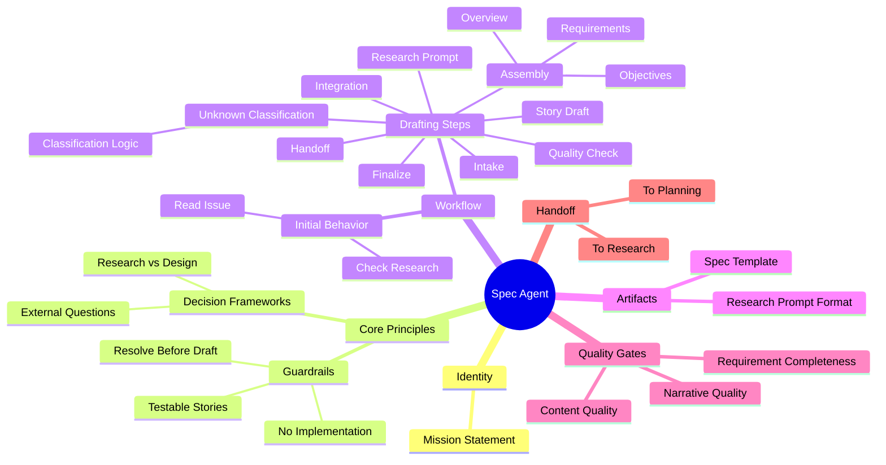

# Context Management Meta-Structure Analysis

## The Problem

Agent prompts contain too much interleaved content to refactor into modular skills effectively. We need a meta-structure that:
- Identifies atomic units of knowledge/instruction
- Represents relationships between units
- Enables context-aware filtering and composition
- Supports skill construction through assembly

## Terminology Candidates

For the atomic unit (leaf annotations):

| Term | Connotation | Fit |
|------|-------------|-----|
| **Grain** | Smallest useful particle, aggregates naturally | ✓ Good |
| **Atom** | Indivisible, fundamental building block | ✓ Good |
| **Fragment** | Broken piece, incomplete feeling | Weak |
| **Nugget** | Valuable small piece of knowledge | ✓ Good |
| **Cell** | Self-contained unit, biological/compositional | ✓ Good |
| **Shard** | Piece of something larger | Weak |
| **Morsel** | Small digestible piece | Decent |
| **Facet** | One aspect/face of a concept | Decent |

**Recommendation**: **Grain** — natural metaphor for aggregation, implies texture/substance, works with "granularity" as a concept.

For collections/sets:

| Term | Relationship to Grain |
|------|----------------------|
| **Cluster** | Natural grouping of related grains |
| **Bundle** | Intentional packaging of grains for use |
| **Facet** | Perspective that selects relevant grains |
| **Aspect** | View/slice through the grain space |
| **Domain** | Bounded context containing grains |

## Proposed Structure

```
┌─────────────────────────────────────────────────────────────────┐
│                         SKILL                                   │
│  (Rendered markdown, the final artifact)                        │
├─────────────────────────────────────────────────────────────────┤
│                                                                 │
│   ┌─────────────┐    ┌─────────────┐    ┌─────────────┐        │
│   │   Bundle    │    │   Bundle    │    │   Bundle    │        │
│   │  "guardrails"│    │  "workflow" │    │  "handoff"  │        │
│   └──────┬──────┘    └──────┬──────┘    └──────┬──────┘        │
│          │                  │                  │                │
│          ▼                  ▼                  ▼                │
│   ┌────────────────────────────────────────────────────┐       │
│   │              GRAIN GRAPH                            │       │
│   │                                                     │       │
│   │   (guardrail:no-impl)──┐                           │       │
│   │   (guardrail:testable) │                           │       │
│   │   (guardrail:resolve)──┴──▶[requires]──▶(workflow:step3)   │
│   │                                                     │       │
│   │   (workflow:step1)──[precedes]──▶(workflow:step2)  │       │
│   │   (workflow:step3)──[contains]──▶(classification)  │       │
│   │                                                     │       │
│   │   (handoff:research)──[depends]──▶(artifact:prompt)│       │
│   └────────────────────────────────────────────────────┘       │
│                                                                 │
└─────────────────────────────────────────────────────────────────┘
```

## Graph Model

### Nodes (Grains)

```yaml
grain:
  id: "guardrail:no-implementation-details"
  type: guardrail          # From annotation taxonomy
  content: |
    Never include implementation details (no tech stack, file paths, 
    library names, code snippets, API signatures).
  tags: [spec, behavioral, prohibition]
  weight: 1.0              # Importance/priority
```

### Edges (Relationships)

| Edge Type | Semantics | Example |
|-----------|-----------|---------|
| `requires` | A needs B to be present | guardrail → workflow-step |
| `precedes` | A comes before B in output | step1 → step2 |
| `contains` | A is parent of B | workflow-step → classification-logic |
| `conflicts` | A and B are mutually exclusive | mode:full ↔ mode:minimal |
| `enriches` | A provides context for B | example → guardrail |
| `implements` | A is concrete form of B | artifact-format → requirement |

### Bundles (Selection Criteria)

```yaml
bundle:
  id: "spec-guardrails"
  description: "Core behavioral constraints for specification work"
  selector:
    type: guardrail
    tags: [spec]
  ordering: weight_desc
  inject_at: "## Core Principles"  # Target location in skill template
```

## Composition Process

```
1. SKILL TEMPLATE (skeleton with injection points)
       │
       ▼
2. BUNDLE RESOLUTION (select grains per bundle criteria)
       │
       ▼
3. GRAIN FILTERING (context-aware: workflow mode, stage, etc.)
       │
       ▼
4. EDGE TRAVERSAL (include required dependencies)
       │
       ▼
5. ORDERING (topological sort + weight)
       │
       ▼
6. RENDERING (grains → markdown sections)
       │
       ▼
7. SKILL OUTPUT (complete agent prompt)
```

## Context-Aware Filtering

The graph enables runtime filtering based on:

```yaml
context:
  workflow_mode: minimal      # → exclude grains tagged "full-only"
  stage: implementation       # → prioritize impl-related grains
  has_research: false         # → include research-prompt grains
  review_strategy: prs        # → include PR-related handoff grains
```

Filter expression example:
```
SELECT grains 
WHERE bundle = "guardrails"
  AND (tags CONTAINS context.stage OR tags CONTAINS "universal")
  AND NOT (tags CONTAINS "full-only" AND context.workflow_mode = "minimal")
ORDER BY weight DESC
```

## Benefits

1. **Deduplication**: Shared grains across skills (guardrails, common patterns)
2. **Consistency**: Single source of truth for each instruction
3. **Flexibility**: Runtime composition based on context
4. **Traceability**: Graph edges explain why content is included
5. **Testability**: Individual grains can be validated
6. **Versioning**: Grain-level change tracking

## Potential Data Format

```yaml
# grains/guardrails/no-implementation.grain.yaml
id: guardrail:no-implementation
type: guardrail
version: 1.0.0
content: |
  **User value focus**: Describe WHAT & WHY, never implementation details 
  (no tech stack, file paths, library names, code snippets, API signatures, 
  class/interface definitions).
tags: [spec, behavioral, prohibition, universal]
weight: 0.95
edges:
  - type: enriches
    target: artifact:spec-template
  - type: requires
    target: workflow:quality-check
```

## Open Questions

1. **Grain granularity**: How small? Single sentence? Paragraph? Logical unit?
2. **Edge semantics**: What relationship types are necessary and sufficient?
3. **Bundle vs. Facet**: Static groupings or dynamic views?
4. **Rendering order**: Pure topological sort or allow explicit sequencing?
5. **Inheritance**: Can grains extend/override other grains?
6. **Validation**: How to ensure graph consistency and completeness?

## Critical Assessment: Why This Might Be Overengineered

### The Core Problem With This Approach

**You're building a content management system when you might just need better files.**

The grain/graph model introduces significant complexity:

1. **Indirection tax**: Every edit now requires understanding the graph topology, not just the prose. Debugging "why did this instruction appear?" becomes a graph traversal problem.

2. **Premature abstraction**: We don't yet know which grains are actually shared. The assumption that guardrails are reusable across agents may be false—context often makes "the same instruction" mean different things.

3. **Composition is hard**: The rendering pipeline (template → bundle → filter → traverse → order → render) has 6 failure points. Each step adds latency to iteration. When you tweak a grain, what breaks?

4. **Maintenance burden**: Now you maintain grains, edges, bundles, selectors, templates, AND the composition tooling. That's 5x the surface area of "one markdown file per agent."

5. **Testing complexity**: How do you test that a composed prompt behaves correctly? You can't diff against a known-good file because the output is generated.

### What We're Actually Trying to Solve

Be honest about the real problems:

- **Duplication**: Some instructions repeat across agents
- **Consistency**: Updates to shared concepts require touching multiple files
- **Context bloat**: Agents get too much irrelevant instruction for their mode

### Simpler Alternatives

**Option A: Component Files + Include**

```markdown
# Agent Prompt

{{include components/guardrails-behavioral.md}}
{{include components/handoff-pattern.md}}

## Agent-Specific Content
...
```

Tooling: One script that resolves includes. Done.

Pros: Trivial to understand, files are readable standalone, git diffs work.
Cons: Less dynamic filtering, includes are all-or-nothing.

**Option B: Templated Markdown with Conditionals**

```markdown
# Agent Prompt


{{include guardrails-full.md}}

{{include guardrails-minimal.md}}

```

Tooling: Jinja2 or similar. Well-understood, battle-tested.

Pros: Dynamic composition, familiar syntax, existing ecosystem.
Cons: Still need to maintain condition logic, templates can get messy.

**Option C: Just Write Better Agents**

Accept that each agent is a document. Optimize for:
- Reading: A human can understand the whole thing in one pass
- Editing: Changes are local, obvious, diffable
- Debugging: When agent misbehaves, the cause is in the file

If duplication exists, manage it through discipline and periodic review, not infrastructure.

### When Grain/Graph IS Appropriate

This architecture makes sense if:

1. You have **50+ agents** with significant structural overlap
2. You need **runtime composition** (user-configurable prompts)
3. You're building a **platform** where others define agents
4. You have dedicated **tooling engineering** capacity

For PAW with ~15 agents maintained by a small team? Probably not.

### The Middle Path

If you still want structure without the full graph:

1. **Annotate** prompts (what you've done)
2. **Extract** obviously shared components to include files
3. **Stop there** until pain forces more abstraction
4. **Revisit** after 6 months: what actually got shared? What broke?

The annotations you have now are valuable for understanding structure. They don't require a graph database to be useful.

### The Real Question

> "Am I building this because it solves a problem I have, or because it's an interesting problem to solve?"

If you're spending more time on the meta-structure than on agent behavior, recalibrate.

---

## Critical Assessment Response

### Reframing the Problem

The critical assessment above mischaracterizes the goal. This isn't about deduplication or even runtime composition. The actual problems are:

1. **Comprehension burden**: Agent files are opaque. Reading one requires mentally summarizing each section, then holding those summaries to understand how they relate. This cognitive load makes it hard to reason about completeness or redundancy.

2. **Authoring difficulty**: Without understanding the structure, writing new agents means copying existing ones and hoping you didn't miss something critical or include something irrelevant.

3. **Cross-project applicability**: This isn't about PAW specifically—it's about developing intuition and tooling for agent/skill composition across many projects and systems.

The meta-structure is a **comprehension and authoring tool**, not a content management system.

### Reassessing With This Frame

**Potential Upsides**

1. **Structural vocabulary**: The annotation taxonomy (`<guardrail>`, `<workflow-step>`, `<handoff-instruction>`) gives names to things. Naming enables discussion, comparison, and pattern recognition across agents.

2. **Explicit purpose**: When each section declares what it IS (via annotation), you stop asking "why is this here?" The answer is encoded in the structure.

3. **Gap detection**: If you know the expected structure (agent-identity, core-principles, workflow, artifacts, quality-gates, handoff), you can mechanically check what's missing. "This agent has no quality-gate—is that intentional?"

4. **Template generation**: Annotated structure becomes a skeleton for new agents. Instead of copying prose, you instantiate the pattern and fill in the specifics.

5. **Cross-project learning**: A consistent meta-structure lets you compare agents across projects. "Project A's research agent has 9 guardrails; Project B's has 3. What's different about their contexts?"

**Downsides, Reconsidered**

1. **Annotation overhead**: You still have to annotate. If the structure isn't obviously valuable during annotation, you're doing busywork.

2. **False structure**: Forcing content into a taxonomy can obscure what's actually happening. Not everything is a guardrail. Categories that don't fit the content create more confusion, not less.

3. **Premature crystallization**: Defining THE structure implies you know what good agents look like. If you're still learning, a fixed taxonomy may calcify bad patterns.

4. **Transfer risk**: A structure that works for PAW's phased workflow may not transfer to other agent architectures. You might be building a PAW-specific tool while thinking you're building a general one.

**Better Alternatives for Comprehension**

If the goal is understanding and authoring (not composition infrastructure), consider:

**Alternative A: Annotations as Documentation, Not Infrastructure**

Keep the XML annotations exactly as you have them. Use them for:
- Human reading (collapsible sections in a viewer)
- Generating summaries ("This agent has: 9 guardrails, 7 workflow steps, 2 artifact formats")
- Linting ("Warning: no handoff-instruction found")

Don't build composition tooling. The value is in the annotations themselves.

**Alternative B: Structural Patterns as Checklists**

Distill the meta-structure into a checklist for authoring:

```
Agent Authorship Checklist:
□ Identity: Who is this agent? One-sentence mission.
□ Principles: What rules always apply? (guardrails)
□ Workflow: What steps does it follow? In what order?
□ Artifacts: What does it produce? What format?
□ Quality: How do we know output is good?
□ Handoff: What happens when it's done? To whom?
```

This gives you the comprehension benefit without building systems.

**Alternative C: Visual Structure Map**

Generate a visual summary from annotations:

```
┌─────────────────────────────────────────┐
│ SPEC AGENT                              │
├───────────────┬─────────────────────────┤
│ Guardrails: 9 │ Steps: 9                │
│ Examples: 4   │ Artifacts: 2            │
│ Quality: 2    │ Handoff paths: 2        │
└───────────────┴─────────────────────────┘
```

This surfaces structure without requiring you to hold it all mentally.

### Guidance

The instinct to find structure is correct. The question is how much infrastructure to build around it.

**My recommendation**: 

1. Finish annotating a few more agents with the current taxonomy
2. See what patterns actually recur vs. what's agent-specific
3. Build the simplest tool that reveals those patterns (probably: summary generator, checklist extractor)
4. Only build composition machinery if you find yourself manually doing composition repeatedly

The annotations are the insight. The graph is speculation about how you'll use that insight. Earn the graph by discovering you need it.

---

## Principal Researcher / Applied Scientist Perspective: Structure-First Prompt Understanding

What you’re after makes sense: a **representation** of an agent prompt that makes intent legible (to you and to tools), not a system that “assembles” prompts.

### Clarify the Output You Want

If the artifact you want is *understanding*, the target outputs are things like:

- A **structural index**: “This agent has N guardrails, M workflow steps, K artifacts, and these are the headings they live under.”
- A **reason map**: “This section exists to constrain behavior / to sequence actions / to define outputs / to define quality.”
- A **navigation view**: “Jump to all handoff instructions” or “show me everything that controls mode switching.”

These can be produced from annotations + visualization without any notion of composing text.

### A Practical Meta-Structure (Minimal, But Powerful)

You already have the right ingredients:

1. **A small taxonomy** (guardrail, workflow-step, artifact-format, quality-gate, handoff-instruction, etc.).
2. **A stable encoding** (your XML-in-markdown convention).
3. **A deterministic normalizer** (the nesting fixer).

The key is to treat the taxonomy as a *research instrument*:

- Start with a small, high-signal set of labels.
- Allow “unknown/other” rather than forcing everything into a bucket.
- Evolve labels based on observed ambiguity (where you routinely hesitate).

### LLM-Driven Annotation: Make It a Repeatable Pipeline

To keep authoring friction low and consistency high across projects:

- Have the agent **emit annotation tags in the canonical, non-nested format** (all tags start with `> `).
- Run the normalizer script to add nesting after the fact.
- Generate a view (mindmap / table / counts) from the normalized file.

This is a good research pattern: *LLM produces a first pass; deterministic tooling enforces structure.*

### Visualization: Mindmap Is Good—Add Two More Views

Mindmaps help with “what’s in here?” but not always with “how do I follow control flow?” Consider pairing:

- **Mindmap (topic decomposition)**: major sections and sub-sections.
- **Flow map (workflow sequencing)**: steps, decision points, and handoffs.
- **Constraint map (guardrails → affected areas)**: which guardrails apply globally vs locally, and where exceptions exist.

All three can be derived from annotations, and they attack different comprehension pain.

### Upsides (In Your Frame)

- **Lower cognitive load**: you stop re-deriving structure mentally.
- **Better prompt authorship**: you can start from a skeleton and fill in content by role.
- **Cross-system transfer**: you build a reusable way to “read” prompts across projects.

### Downsides (In Your Frame)

- **Schema drift**: taxonomy changes can invalidate comparisons over time.
- **Annotation consistency**: LLM tagging will vary unless you lock down conventions and add lint checks.
- **Overconfidence risk**: structure can create a false sense of completeness (“all sections present” ≠ “good prompt”).

### Alternatives That Still Serve the Same Goal

If you want comprehension tooling with even less formalism:

- **Structured outlines only**: headings + bullet summaries per section, no tags.
- **Section-purpose headers**: one-line “purpose” statement under each heading.
- **Prompt cards**: each section becomes a card with `{purpose, triggers, do/don’t, outputs}`.

The advantage of tags is that they make these alternatives machine-derivable rather than manually maintained.

### Mentoring Guidance

Treat this as building a “prompt readability layer.” If you keep it structure-first (annotate → normalize → visualize → lint), you’ll get most of the benefit without drifting into a brittle composition system.

If you want the fastest next experiment: annotate 3–5 agents across different roles, generate mindmaps + a workflow flow view, and measure whether your time-to-understand/time-to-author drops in practice.

---

## Applying the Meta-Structure to Your Current Task

### The Practical Problem

You're trying to:

1. **Audit existing PAW agents** — understand what's in each prompt file
2. **Compare to HumanLayer agents** — spot divergences and improvements to import
3. **Separate workflow-bound content from reusable skills** — what belongs to "Implementation Plan phase" vs. what's a general capability?
4. **Enable cross-workflow skill invocation** — an agent in one phase should be able to call upon skills from another phase without entering that workflow

This is a *classification and extraction* problem. The meta-structure helps by giving you a lens to categorize content.

### A Classification Lens: Workflow-Bound vs. Skill-Bound Content

Propose a two-axis classification for any section of an agent prompt:

| | **Phase-Specific** | **Phase-Agnostic** |
|---|---|---|
| **Workflow-Controlling** | Phase transitions, handoffs, stage gates | Workflow mode selection, error recovery |
| **Capability/Skill** | Phase-specific artifacts (e.g., "write Spec.md") | General skills (review, summarize, explain) |

When annotating, you're implicitly doing this classification:

- `<handoff-instruction>` → workflow-controlling, often phase-specific
- `<guardrail>` → could be either (some guardrails are universal, some are phase-specific)
- `<workflow-step>` → workflow-controlling, phase-specific
- `<artifact-format>` → capability, often phase-specific
- `<communication-pattern>` → capability, often phase-agnostic (reusable skill)

### How Annotations Help With Your Task

**1. Auditing PAW agents**

Annotate each agent. The resulting structure gives you:
- A checklist of what each agent "knows how to do"
- A count of guardrails, workflow steps, artifacts, etc.
- A visual map for quick comparison

**2. Comparing to HumanLayer agents**

Annotate a few HumanLayer agents with the same taxonomy. Now you can:
- Diff structurally: "PAW-01A has 9 guardrails; HL equivalent has 5. What's different?"
- Spot content that exists in one but not the other
- Identify where HL has evolved a pattern that PAW hasn't adopted

The annotations become a *diff interface* for prompts.

**3. Separating workflow-bound from reusable skills**

Add a secondary tag or attribute to annotations:

```markdown
> `<communication-pattern context="deep-review" scope="reusable">`
```

or simply maintain a parallel classification:

```yaml
# skills-classification.yaml
reusable:
  - communication-pattern:deep-review
  - communication-pattern:incremental-writing
  - guardrail:no-fabrication
  - decision-framework:quality-gate-blocking

phase-bound:
  - workflow-step:spec-assembly
  - artifact-format:specification-template
  - handoff-instruction:to-research
```

Once classified, you can:
- Extract reusable items into shared skill files
- Keep phase-bound items in the workflow-specific agent

**4. Cross-workflow skill invocation**

If an Implementation Plan agent needs to "do a deep review" without triggering the Review workflow, it needs access to the *skill* without the *workflow orchestration*.

The meta-structure clarifies this:
- **Skill content** (how to review): extract to a shared skill file
- **Workflow content** (when to invoke Review agent, handoff protocol): stays in workflow definition

An agent can then include:

```markdown
{{include skills/deep-review.md}}
```

...without inheriting the review workflow's handoff logic.

### Process Suggestion

1. **Annotate PAW agents** with the current taxonomy (you've started with PAW-01A)
2. **Annotate 2-3 HumanLayer agents** for comparison
3. **Generate side-by-side views** (mindmaps, counts, structure summaries)
4. **Classify each annotation** as workflow-bound or reusable (add to a tracking file)
5. **Extract reusable skills** to standalone files (don't compose—just extract and include)
6. **Test**: Can an agent in Phase X use a skill from Phase Y by including it directly?

### What the Meta-Structure Buys You Here

- **Vocabulary for classification**: instead of "this part feels reusable," you have "this is a `<communication-pattern>` tagged `scope=reusable`"
- **Diffable representation**: comparing annotated prompts is more tractable than comparing prose
- **Extraction guide**: annotations mark the boundaries of what to extract
- **Validation**: after extraction, you can verify the remaining agent still has the required structure (identity, workflow, handoff, etc.)

### Risks to Watch

- **Over-extraction**: pulling out too many "skills" creates a fragmented mess. Start with obvious wins (deep-review, quality-check patterns).
- **Leaky abstractions**: a skill extracted from one context may assume things that aren't true elsewhere. Test extracted skills in multiple agents.
- **Taxonomy creep**: adding `scope`, `phase`, `reusable` attributes can bloat the annotation format. Keep it minimal until you need more.

### Concrete Next Step

Pick one capability you know is reusable (e.g., "deep review" or "incremental writing"). Find it in multiple PAW agents. Annotate those sections. Extract to a shared file. Include in one agent. Verify behavior. That's your proof-of-concept for skill extraction guided by meta-structure.

---

## Next Steps

1. Extract grains from one annotated agent (PAW-01A Specification)
2. Define minimal edge type vocabulary
3. Build prototype composition script
4. Validate: can we reconstruct the original prompt from grains?
5. Test: compose a variant (minimal mode) from same grain set

## Visualization Idea

Mermaid mindmap for skill overview, with grains as leaves:



This mindmap could be generated FROM the grain graph, providing both human-readable overview and machine-processable structure.
