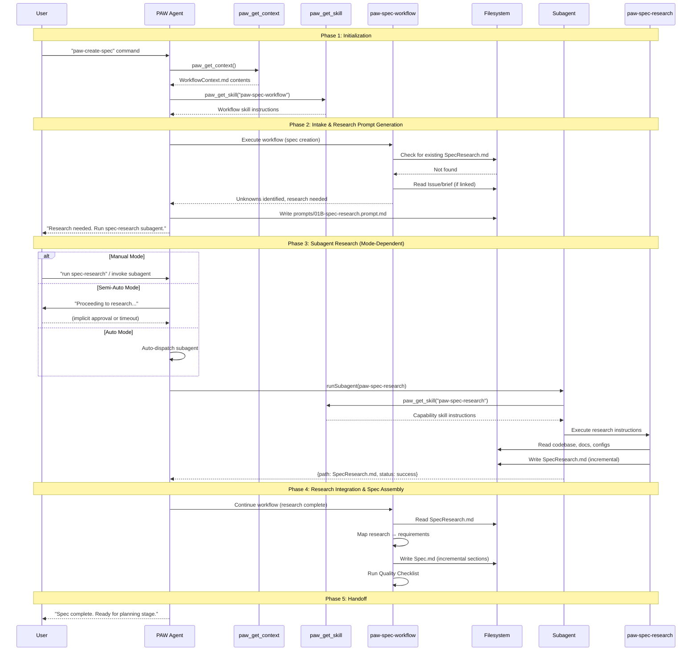
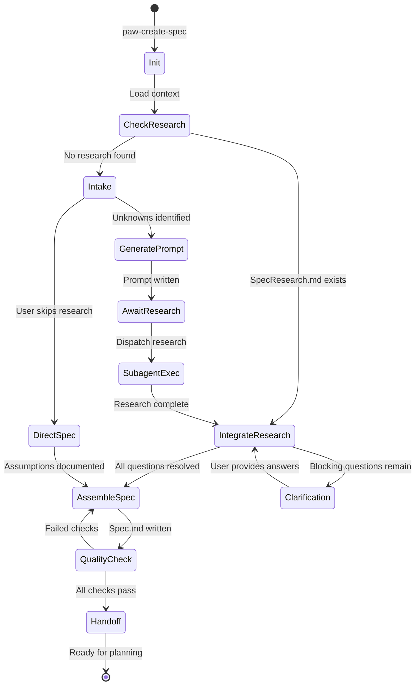
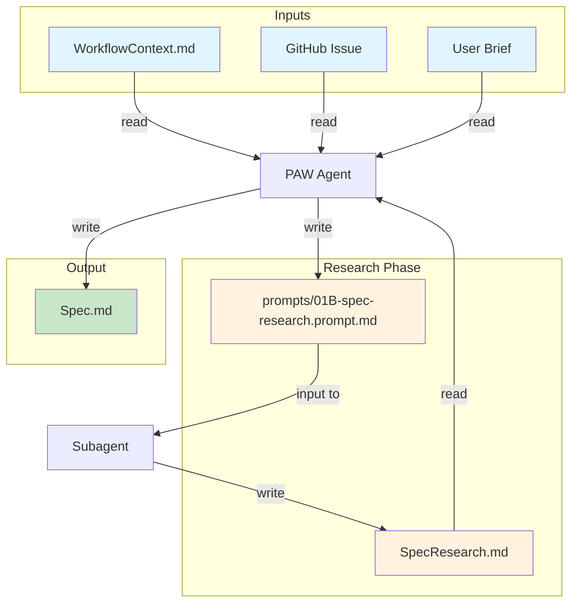
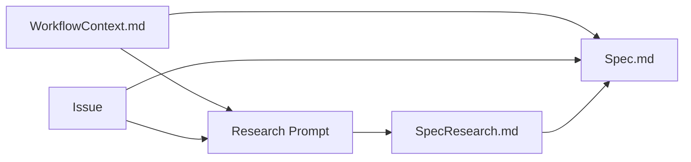

# Create Spec Flow Walkthrough (V2 Architecture Validation)

**Purpose**: Validate the V2 control plane taxonomy by tracing through the "create spec" flow end-to-end.

**Related**: [GoDo-2_v2-control-plane-taxonomy.md](GoDo-2_v2-control-plane-taxonomy.md)

---

## 1. Flow Overview

### High-Level Sequence Diagram



### Simplified State Machine



---

## 2. Step-by-Step Walkthrough

### Step 1: User Invokes Command

| Attribute | Value |
|-----------|-------|
| **Actor** | User |
| **Action** | Issues `paw-create-spec` prompt command (or selects from UI) |
| **Skill/Tool Used** | Prompt command recognition (entry point) |
| **Input** | User intent, optional feature slug or Issue URL |
| **Output** | PAW Agent activation with spec workflow intent |
| **State Change** | Session begins; PAW Agent initialized |

**Notes**: 
- Prompt commands are user-facing entry points that map to workflow skills
- The command may include inline context: `paw-create-spec auth-refactor` or `paw-create-spec --issue #42`

---

### Step 2: Load Workflow Context

| Attribute | Value |
|-----------|-------|
| **Actor** | PAW Agent |
| **Action** | Calls `paw_get_context` tool to load workflow state |
| **Skill/Tool Used** | `paw_get_context` tool + `paw-context-provider` cross-cutting skill |
| **Input** | Feature slug (derived or provided) |
| **Output** | WorkflowContext.md contents (mode, strategy, custom instructions) |
| **State Change** | PAW Agent now aware of: workflow mode, review strategy, existing artifacts |

**Context Structure Retrieved**:
```yaml
feature_slug: auth-refactor
workflow_mode: full | minimal | custom
review_strategy: prs | single-pr | none
target_branch: main
issue_url: https://github.com/org/repo/issues/42
custom_instructions: (if any)
existing_artifacts:
  - SpecResearch.md: false
  - Spec.md: false
```

---

### Step 3: Load Workflow Skill

| Attribute | Value |
|-----------|-------|
| **Actor** | PAW Agent |
| **Action** | Retrieves `paw-spec-workflow` skill instructions |
| **Skill/Tool Used** | `paw_get_skill` tool |
| **Input** | Skill name: `paw-spec-workflow` |
| **Output** | Complete workflow instructions (spec template, quality checklist, procedures) |
| **State Change** | PAW Agent now has spec-creation instructions loaded |

**Skill Loading Consideration**:
- Workflow skills may reference cross-cutting skills
- `paw-spec-workflow` implicitly uses: `paw-artifact-conventions`, `paw-github-integration`, `paw-handoff-procedures`
- These may be bundled or loaded on-demand

---

### Step 4: Check for Existing Research

| Attribute | Value |
|-----------|-------|
| **Actor** | PAW Agent (via workflow skill) |
| **Action** | Checks filesystem for `.paw/work/<slug>/SpecResearch.md` |
| **Skill/Tool Used** | `paw-state-inspector` cross-cutting skill (artifact existence check) |
| **Input** | Expected artifact path |
| **Output** | Boolean: research exists or not |
| **State Change** | Decision point: skip to integration or proceed with research prompt |

**Branch Point**:
- If `SpecResearch.md` exists → Skip to Step 8 (Research Integration)
- If not found → Continue to Step 5 (Intake)

---

### Step 5: Intake & Decomposition

| Attribute | Value |
|-----------|-------|
| **Actor** | PAW Agent (via workflow skill) |
| **Action** | Read Issue/brief, extract requirements, identify unknowns |
| **Skill/Tool Used** | `paw-spec-workflow` (intake section) + `paw-github-integration` (if Issue linked) |
| **Input** | Issue body + comments, user brief, constraints |
| **Output** | Decomposed: goal, actors, value props, constraints, unknowns |
| **State Change** | PAW Agent has structured understanding of feature intent |

**Unknown Classification**:
1. **Reasonable default** → Document as Assumption (no research needed)
2. **Research question** → Add to research prompt (existing system behavior)
3. **Clarification required** → Block and ask user (high-impact ambiguity)

---

### Step 6: Generate Research Prompt

| Attribute | Value |
|-----------|-------|
| **Actor** | PAW Agent (via workflow skill) |
| **Action** | Create `prompts/01B-spec-research.prompt.md` with research questions |
| **Skill/Tool Used** | `paw-spec-workflow` (research prompt generation) |
| **Input** | Classified unknowns, agent notes from intake |
| **Output** | Research prompt file on disk |
| **State Change** | Artifact created: `prompts/01B-spec-research.prompt.md` |

**Prompt Structure**:
```markdown
---
agent: 'paw-spec-research'  # v2: skill name instead of agent name
---
# Spec Research Prompt: <feature>

Target Branch: <branch>
Issue URL: <url or 'none'>

## Agent Notes
<Context from intake to guide research>

## Questions
1. How does the current authentication system validate sessions?
2. What error response format do existing API endpoints use?

### Optional External / Context
1. Are there compliance requirements for session timeout duration?
```

---

### Step 7: Subagent Invocation (Research)

| Attribute | Value |
|-----------|-------|
| **Actor** | PAW Agent |
| **Action** | Dispatch subagent for `paw-spec-research` capability |
| **Skill/Tool Used** | `paw_call_agent` tool (or subagent mechanism) |
| **Input** | Research prompt path, feature slug |
| **Output** | Subagent session with research capability loaded |
| **State Change** | New subagent context; PAW Agent waiting |

**Mode-Dependent Behavior**:
| Mode | Behavior |
|------|----------|
| Manual | PAW Agent presents option; user explicitly invokes |
| Semi-Auto | PAW Agent announces intent; proceeds unless user intervenes |
| Auto | PAW Agent dispatches immediately without pause |

**Subagent Contract**:
```typescript
interface SubagentInvocation {
  skill: 'paw-spec-research';
  input: {
    promptPath: string;
    featureSlug: string;
  };
  expected_output: {
    artifactPath: string;  // SpecResearch.md
    status: 'success' | 'partial' | 'blocked';
    openUnknowns?: string[];
  };
}
```

---

### Step 7a: Subagent Executes Research

| Attribute | Value |
|-----------|-------|
| **Actor** | Subagent |
| **Action** | Load `paw-spec-research` skill, execute research instructions |
| **Skill/Tool Used** | `paw-spec-research` capability skill |
| **Input** | Research prompt, codebase access |
| **Output** | Research findings (behavioral, not implementation) |
| **State Change** | Subagent exploring codebase |

**Research Execution**:
1. Load prompt file
2. For each question:
   - Explore codebase (read files fully, no truncation)
   - Document behavioral findings (not file:line references)
   - Note evidence sources conceptually
3. Build SpecResearch.md incrementally
4. Mark unanswerable questions as "Open Unknowns"

---

### Step 7b: Subagent Writes SpecResearch.md

| Attribute | Value |
|-----------|-------|
| **Actor** | Subagent |
| **Action** | Write research findings to canonical artifact path |
| **Skill/Tool Used** | `paw-artifact-conventions` cross-cutting skill |
| **Input** | Research findings |
| **Output** | `.paw/work/<slug>/SpecResearch.md` |
| **State Change** | Artifact created; subagent completes |

**Artifact Structure**:
```markdown
# Spec Research: <feature>

## Summary
<1-2 paragraphs: key findings overview>

## Agent Notes
<Preserved from prompt if present>

## Research Findings

### Question 1: How does authentication validate sessions?
**Answer**: The system uses session tokens stored in HTTP-only cookies...
**Evidence**: API documentation, config behavior
**Implications**: New feature must integrate with existing session store

### Question 2: ...

## Open Unknowns
- External compliance requirements (cannot determine from codebase)

## User-Provided External Knowledge (Manual Fill)
- [ ] Are there compliance requirements for session timeout duration?
```

---

### Step 7c: Subagent Returns to PAW Agent

| Attribute | Value |
|-----------|-------|
| **Actor** | Subagent → PAW Agent |
| **Action** | Return control with result summary |
| **Skill/Tool Used** | Subagent return protocol |
| **Input** | Subagent execution result |
| **Output** | `{path: SpecResearch.md, status: success, openUnknowns: [...]}` |
| **State Change** | PAW Agent resumes with research available |

---

### Step 8: Research Integration

| Attribute | Value |
|-----------|-------|
| **Actor** | PAW Agent (via workflow skill) |
| **Action** | Read SpecResearch.md, map findings to requirements |
| **Skill/Tool Used** | `paw-spec-workflow` (integration section) |
| **Input** | SpecResearch.md contents |
| **Output** | Resolved questions, updated assumptions |
| **State Change** | All research questions mapped; ready for spec assembly |

**Integration Process**:
1. Read SpecResearch.md
2. For each research question → answer:
   - Update related user stories
   - Refine requirements based on findings
   - Convert open unknowns to assumptions (with risk notes)
3. Check for new clarifications surfaced by research
4. If blocking clarifications → pause and ask user

---

### Step 9: Spec Assembly (Incremental)

| Attribute | Value |
|-----------|-------|
| **Actor** | PAW Agent (via workflow skill) |
| **Action** | Build Spec.md section by section |
| **Skill/Tool Used** | `paw-spec-workflow` (template + assembly), `paw-artifact-conventions` |
| **Input** | Issue, research findings, assumptions |
| **Output** | `.paw/work/<slug>/Spec.md` (written incrementally) |
| **State Change** | Spec artifact created and populated |

**Assembly Order**:
1. Header (branch, date, status, brief)
2. **Overview** (2-4 paragraphs, narrative prose)
3. **Objectives** (bulleted behavioral goals)
4. **User Scenarios & Testing** (P1 stories first, then P2+, edge cases)
5. **Requirements** (FR-001, FR-002... with story links)
6. **Success Criteria** (SC-001, SC-002... with FR links)
7. **Assumptions**, **Scope**, **Dependencies**, **Risks**
8. **References** (Issue link, SpecResearch.md link)

---

### Step 10: Quality Checklist Validation

| Attribute | Value |
|-----------|-------|
| **Actor** | PAW Agent (via workflow skill) |
| **Action** | Run quality checklist against Spec.md |
| **Skill/Tool Used** | `paw-spec-workflow` (quality checklist section) |
| **Input** | Completed Spec.md |
| **Output** | Pass/fail results per checklist item |
| **State Change** | Spec validated or iteration needed |

**Quality Dimensions**:
- **Content Quality**: No implementation details, clear priorities, testable stories
- **Narrative Quality**: Overview is prose (not bullets), user perspective maintained
- **Requirement Completeness**: All FRs testable, linked to stories, SCs measurable
- **Ambiguity Control**: No unresolved clarifications
- **Scope & Risk**: Clear boundaries, mitigations captured

**Iteration Loop**: If checks fail → refine spec → re-run checklist

---

### Step 11: Handoff

| Attribute | Value |
|-----------|-------|
| **Actor** | PAW Agent |
| **Action** | Present completion status and next-step options |
| **Skill/Tool Used** | `paw-handoff-procedures` cross-cutting skill |
| **Input** | Completed spec, workflow mode |
| **Output** | Handoff message with options |
| **State Change** | Spec stage complete; ready for planning stage |

**Handoff Message**:
```
✅ Spec Complete

Artifacts created:
- .paw/work/auth-refactor/Spec.md
- .paw/work/auth-refactor/SpecResearch.md

**Next Steps:**
- `plan` - Create implementation plan (PAW-02B)
- `status` - Check workflow status

Ready to proceed?
```

---

## 3. Decision Points

### 3.1 Research Needed vs. Skip Research

**Decision Point**: After intake, should PAW Agent generate a research prompt?

| Condition | Decision | Rationale |
|-----------|----------|-----------|
| SpecResearch.md exists | Skip to integration | Research already done |
| User says "skip research" | Direct spec with assumptions | User override |
| All unknowns → reasonable defaults | Skip research | No questions to answer |
| Unknowns about existing system behavior | Generate research prompt | Need factual answers |

**V2 Consideration**: This decision is made by PAW Agent using workflow skill instructions, not hardcoded in tool logic.

---

### 3.2 When to Invoke Subagent for Research

**Decision Point**: After generating research prompt, how/when is subagent dispatched?

| Mode | Trigger | PAW Agent Behavior |
|------|---------|-------------------|
| Manual | User explicit command | Present options, wait for user |
| Semi-Auto | Time delay or user acknowledgment | Announce intent, short pause, proceed |
| Auto | Immediate | Dispatch subagent without pause |

**Subagent Invocation Criteria**:
1. Research prompt exists
2. Research artifact doesn't exist (or is stale)
3. Mode permits autonomous action OR user has approved

---

### 3.3 Research Complete → Resume Spec

**Decision Point**: When does PAW Agent know research is complete?

| Signal | Source | Action |
|--------|--------|--------|
| Subagent returns success | Subagent protocol | Resume workflow |
| SpecResearch.md written | Filesystem watch / check | Resume workflow |
| User says "research done" | Manual mode interaction | Resume workflow |

**V2 Pattern**: Subagent returns structured result, not just signal. PAW Agent can inspect `openUnknowns` to decide if clarification is needed.

---

### 3.4 Blocking Clarification vs. Assumption

**Decision Point**: For each unknown, should we block for clarification or proceed with assumption?

| Unknown Type | Decision | Example |
|--------------|----------|---------|
| Low-impact, has reasonable default | Assumption | "Assuming standard 30-minute session timeout" |
| High-impact, ambiguous scope | Clarification | "Does this feature include admin users?" |
| Security/compliance | Clarification | "Are there PII handling requirements?" |
| Existing system behavior | Research question | "How does current auth work?" |

**Guardrail**: Never proceed with unresolved blocking clarifications. Pause and ask user.

---

## 4. Artifact Flow Diagram

### Artifact Lifecycle in Spec Stage



### Artifact Details

| Artifact | Path | Created By | Read By | Purpose |
|----------|------|------------|---------|---------|
| WorkflowContext.md | `.paw/work/<slug>/WorkflowContext.md` | Extension/Init | PAW Agent | Workflow state & config |
| Research Prompt | `prompts/01B-spec-research.prompt.md` | PAW Agent (spec workflow) | Subagent | Research questions |
| SpecResearch.md | `.paw/work/<slug>/SpecResearch.md` | Subagent (spec-research) | PAW Agent | Research findings |
| Spec.md | `.paw/work/<slug>/Spec.md` | PAW Agent (spec workflow) | Planning stage | Feature specification |

### Artifact Dependencies



---

## 5. Validation Questions

This walkthrough helps answer the following questions about the V2 architecture:

### 5.1 Does the Subagent Pattern Work for Spec Research?

**Assessment**: ✅ Yes, with considerations

**Evidence**:
- Research is a bounded task with clear inputs (questions) and outputs (answers)
- Subagent doesn't need workflow state awareness—only codebase access
- Return contract is simple: artifact path + status + open unknowns

**Considerations**:
- Subagent needs full codebase read access
- Token context for research can be large (reading many files)
- Subagent should NOT inherit PAW Agent's full context (wasteful)

---

### 5.2 Are the Skill Boundaries Clear?

**Assessment**: ✅ Mostly clear, one area needs attention

| Boundary | Clarity | Notes |
|----------|---------|-------|
| Workflow vs Capability | ✅ Clear | Workflow orchestrates; capability executes bounded task |
| PAW Agent vs Workflow Skill | ⚠️ Needs clarity | When does PAW Agent "execute" vs "load" skill? |
| Capability Skill vs Tool | ✅ Clear | Skills are instructions; tools are procedural operations |

**Area Needing Attention**:
- Is the workflow skill a document PAW Agent reads, or does PAW Agent "become" the skill?
- Recommendation: Skill is loaded instructions that PAW Agent follows, not a separate executor

---

### 5.3 Where Might Token Context Become a Problem?

**Risk Areas Identified**:

| Step | Token Risk | Mitigation |
|------|------------|------------|
| Loading workflow skill | Medium | Skills should be concise; use cross-cutting references not inline duplication |
| Issue + comments | Medium | Summarize large issues; don't load full comment history |
| Subagent research | High | Subagent reads many files; needs efficient reading strategy |
| Spec assembly | Low | Spec is generated output, not loaded context |
| Quality checklist | Low | Checklist is compact |

**Highest Risk**: Subagent research phase
- If subagent reads 20+ files fully, context explodes
- Mitigation: Incremental reading, summarization, or RAG-style retrieval

---

### 5.4 What's the Handoff Contract Between PAW Agent and Subagent?

**Proposed Contract**:

```typescript
// Invocation
interface SubagentRequest {
  skill: string;              // e.g., 'paw-spec-research'
  featureSlug: string;        // Work item context
  inputs: {
    promptPath?: string;      // Optional prompt file
    targetBranch?: string;    // Git context
  };
  contextTransfer: 'minimal' | 'full';  // How much PAW context to pass
}

// Return
interface SubagentResult {
  status: 'success' | 'partial' | 'blocked' | 'error';
  artifacts: {
    path: string;
    type: 'created' | 'updated';
  }[];
  openItems?: string[];       // Unresolved questions
  blockers?: string[];        // Why blocked (if status=blocked)
  summary?: string;           // Brief description of work done
}
```

**Key Design Decision**: `contextTransfer: 'minimal'` for research subagents
- Subagent gets: feature slug, prompt, codebase access
- Subagent does NOT get: full PAW Agent context, prior conversation, other artifacts

---

### 5.5 How Does Mode Affect the Flow?

| Mode | Research Dispatch | Clarification Handling | Handoff Style |
|------|-------------------|----------------------|---------------|
| Manual | User must invoke | Interactive Q&A | Options presented |
| Semi-Auto | Announced, proceeds | Batched questions | Brief pause, then proceed |
| Auto | Immediate | Blocks only on critical | Immediate continuation |

**V2 Consideration**: Mode is a property of WorkflowContext, checked by `paw-handoff-procedures` cross-cutting skill.

---

## 6. Identified Gaps or Issues

### Gap 1: Skill Loading Mechanism Undefined

**Issue**: How exactly does PAW Agent "load" a skill?
- Is it a tool call: `paw_get_skill("paw-spec-workflow")`?
- Does the skill content replace PAW Agent's instructions?
- Or is it appended to PAW Agent's context?

**Recommendation**: Define `paw_get_skill` tool behavior:
```typescript
// Returns skill content that PAW Agent incorporates into its instructions
paw_get_skill(name: string): {
  content: string;           // Skill instructions (markdown)
  crossCutting: string[];    // Referenced cross-cutting skills to also load
  tokens: number;            // Estimated token count
}
```

---

### Gap 2: Cross-Cutting Skill Resolution

**Issue**: When workflow skill references a cross-cutting skill (e.g., `paw-artifact-conventions`), how is it resolved?
- Inline during skill loading?
- Separate tool call?
- Pre-bundled into workflow skill?

**Options**:
1. **Inline expansion**: Cross-cutting content inserted into workflow skill at load time
2. **Lazy loading**: PAW Agent loads cross-cutting skill when needed
3. **Bundled**: Workflow skill includes relevant cross-cutting excerpts

**Recommendation**: Option 1 (inline expansion) for simplicity, with token budget awareness.

---

### Gap 3: Subagent Context Isolation

**Issue**: How isolated is subagent context from PAW Agent context?
- Does subagent start fresh?
- Does subagent inherit WorkflowContext?
- Can subagent access PAW Agent's conversation history?

**Recommendation**: Minimal context transfer
- Subagent gets: WorkflowContext.md, prompt file, codebase access
- Subagent does NOT get: PAW Agent conversation, loaded skills, prior context

**Implementation Note**: `paw_call_agent` (or subagent mechanism) must specify context transfer policy.

---

### Gap 4: Research Prompt Location

**Issue**: Current v1 puts research prompt in `prompts/01B-spec-research.prompt.md`. Should v2 change this?

**Considerations**:
- Current location is outside `.paw/work/<slug>/`
- Could cause confusion about which prompts belong to which work item
- Alternative: `.paw/work/<slug>/prompts/spec-research.prompt.md`

**Recommendation**: Move to work-item-scoped location:
```
.paw/work/<slug>/
  prompts/
    spec-research.prompt.md
  SpecResearch.md
  Spec.md
```

---

### Gap 5: Partial Research Handling

**Issue**: What if subagent returns `status: partial` with some open unknowns?

**Current v1 Behavior**: Open unknowns listed in SpecResearch.md, Spec Agent continues with assumptions.

**V2 Consideration**: Should PAW Agent:
1. Proceed with assumptions (current behavior)
2. Prompt user about open unknowns before continuing
3. Attempt to reclassify unknowns (research → clarification → assumption)

**Recommendation**: Mode-dependent handling:
| Mode | Partial Research Behavior |
|------|--------------------------|
| Manual | Present open unknowns, ask user how to proceed |
| Semi-Auto | Announce assumptions, brief pause, proceed |
| Auto | Proceed with assumptions, note in Spec.md |

---

### Gap 6: Quality Gate Enforcement

**Issue**: What happens if quality checklist fails after multiple iterations?

**Current v1 Behavior**: "Iterate until all pass (or user accepts explicit residual risks)"

**V2 Consideration**: Need explicit escape hatch:
- Max iteration count?
- User override mechanism?
- Risk acknowledgment artifact?

**Recommendation**: After 3 failed iterations, present options:
1. Continue iterating (with specific failing items highlighted)
2. Accept with risk acknowledgment (logged in artifact)
3. Escalate to user review before proceeding

---

### Gap 7: Skill Version / Compatibility

**Issue**: If skills are stored separately, how do we handle skill versioning?

**Considerations**:
- Skills may evolve over time
- Old work items might need old skill versions
- Breaking changes to skills could affect in-progress work

**Recommendation**: Defer for v2 initial implementation, but design for it:
- Skills have version identifiers
- WorkflowContext can pin skill versions
- Default: use latest skill version

---

## 7. Summary & Next Steps

### Key Findings

1. **Subagent pattern is viable** for bounded capability tasks like spec research
2. **Skill boundaries are clear** at the conceptual level; implementation details need specification
3. **Token context** is manageable except for research phase (needs efficient reading strategy)
4. **Mode-dependent behavior** adds complexity but is essential for user control

### Recommended Next Steps

1. **Define `paw_get_skill` tool interface** - Specify return structure and cross-cutting resolution
2. **Specify subagent invocation protocol** - Context transfer, return contract, error handling
3. **Decide on prompt file location** - Recommend moving to work-item-scoped directory
4. **Prototype the flow** - Build minimal implementation to validate token budgets

### Architecture Validation Status

| Aspect | Status | Notes |
|--------|--------|-------|
| Control plane taxonomy | ✅ Validated | Roles are clear and consistent |
| Subagent delegation | ✅ Validated | Works for research pattern |
| Skill system | ⚠️ Needs detail | Loading mechanism undefined |
| Tool interfaces | ⚠️ Needs detail | `paw_get_skill`, `paw_call_agent` specs needed |
| Mode handling | ✅ Validated | Clear differentiation |
| Artifact flow | ✅ Validated | Dependencies are reasonable |
