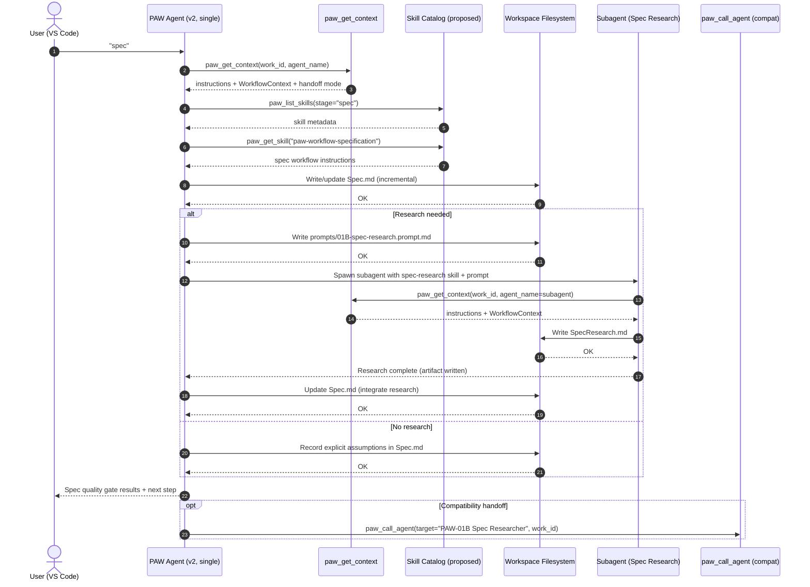

# GoDo-2 (v2): Create-Spec Flow Walkthrough (Sidecar)

> Alternative implementation doc. Sidecar to `GoDo-2_v2-control-plane-taxonomy_v2.md`.
> Purpose: work the “create spec” flow end-to-end on paper.

## Goal

Describe an end-to-end “create spec” flow under PAW v2:
- which prompt-command the user runs
- which skills the PAW Agent loads
- which subagents are invoked (if any)
- which tools are called
- which artifacts are written
- what the happy path and minimal failure handling look like

## Assumptions

- v2 has a single **PAW Agent** that orchestrates workflow by dynamically loading skills via tools.
- Subagents exist but cannot depend on custom agent definition files; they load skills via tools.
- VS Code centric. Proposed tools may be referenced: `paw_list_skills`, `paw_get_skill`.

---

## 1) User Invocation (Prompt-Command)

Start “create spec” in one of two VS Code-native ways.

### A) Chat command (fast path)

User types:

- `spec`

Optional inline constraints:

- `spec but focus on MVP scope and measurable acceptance criteria`
- `spec but skip research`

### B) Prompt file (auditable path)

User requests a prompt file and runs it:

- In chat: “generate prompt for spec”
- PAW Agent calls `paw_generate_prompt` to create a file like:
	- `.paw/work/<work-id>/prompts/01A-spec.prompt.md`

User opens the prompt file in VS Code, optionally edits it, then runs the prompt.

---

## 2) Actors & Responsibilities

### User (human)

- Provides the initial brief / Issue URL and resolves true intent questions.
- Approves tool invocations (context fetch, prompt generation).
- Decides whether to run research (unless workflow mode mandates it).

### PAW Agent (single v2 agent)

- Orchestrates the spec flow.
- Dynamically loads the right skills and applies them.
- Writes/updates artifacts in `.paw/work/<work-id>/…`.

### Subagent: “Spec Researcher” (conceptual)

- Executes behavioral research prompts to produce `SpecResearch.md`.
- Operates using skills loaded via tools (not a custom agent file).

---

## 3) Artifacts Produced (Create Spec Stage)

All artifacts live under `.paw/work/<work-id>/`.

Required / expected outputs (full mode):
- `.paw/work/<work-id>/WorkflowContext.md`
- `.paw/work/<work-id>/Spec.md`

Conditional / typical outputs when research is needed:
- `.paw/work/<work-id>/prompts/01B-spec-research.prompt.md` (generated by the spec workflow)
- `.paw/work/<work-id>/SpecResearch.md` (generated by a spec research subagent)

---

## 4) Gating Points (Hard Stops)

### Gate G0 — Work ID validity

Trigger: any tool requiring a Work ID (notably `paw_get_context`, `paw_generate_prompt`).

Failure mode: Work ID invalid or missing, or `.paw/work/<work-id>/` does not exist.

Expected outcome:
- Agent asks the user to confirm Work ID and/or initialize a work item so the directory exists.

### Gate G1 — Blocking intent clarifications

Trigger: the brief is ambiguous about scope/actors/security/user journey.

Rule: do not write Spec sections with unresolved critical questions.

### Gate G2 — Research needed vs assumptions allowed

Unknowns found while drafting must be classified as:
- Assumptions (low-impact defaults)
- Research questions (existing system behavior)
- Blocking clarifications (must be answered)

### Gate G3 — Spec quality checklist

Before finalizing `Spec.md`, ensure:
- stories are testable and prioritized
- requirements and success criteria are measurable
- traceability exists (Stories ↔ FR ↔ SC)
- no implementation details leak into the spec

---

## 5) Tool Calls Used in the Spec Flow

Existing tools (implemented today):

1) `paw_get_context`
- Purpose: load workspace instructions, user instructions, and `WorkflowContext.md` (if present), plus handoff-mode instructions.

2) `paw_generate_prompt`
- Purpose: generate prompt files in `.paw/work/<work-id>/prompts/…`.

3) `paw_call_agent`
- Purpose: open a new chat targeting another agent mode (compatibility escape hatch in v2).

Proposed v2 tools:

1) `paw_list_skills`
- Purpose: enumerate skills available for a stage (metadata only).

2) `paw_get_skill`
- Purpose: fetch one skill’s instruction payload (full content).

---

## 6) End-to-End Walkthrough (Happy Path)

### Step 1 — Start

User invocation:
- `spec`

PAW Agent actions:
1. Determine/confirm Work ID and verify the work directory exists.
2. Load context and instructions.

Tool call:
- `paw_get_context({ feature_slug: "<work-id>", agent_name: "PAW Agent" })`

### Step 2 — Load skills needed for “create spec”

PAW Agent actions:
1. Ask the skill catalog what’s available.
2. Load the “create spec” workflow skill bundle (intake → story derivation → FR/SC → research prompt generation → quality checklist).

Proposed tool calls:
- `paw_list_skills({ stage: "spec" })`
- `paw_get_skill({ id: "paw-workflow-specification" })`
- `paw_get_skill({ id: "paw-capability-spec-research" })` (conditional)

### Step 3 — Intake & decomposition (interactive)

PAW Agent actions:
1. Read Issue URL if present in `WorkflowContext.md`; otherwise ask for a brief.
2. Extract goal/actors/constraints.
3. Ask only blocking questions.

### Step 4 — Draft stories & acceptance scenarios

PAW Agent actions:
1. Create prioritized stories (P1, P2, …) with independent tests and G/W/T acceptance scenarios.
2. Classify unknowns into assumptions vs research vs blocking clarifications.

Artifact written (incrementally):
- `.paw/work/<work-id>/Spec.md`

### Step 5 — Enumerate requirements + success criteria

PAW Agent actions:
1. Add FR IDs mapped to stories.
2. Add SC IDs mapped to FRs.
3. Add scope boundaries, assumptions, dependencies, risks.

Artifact updated:
- `.paw/work/<work-id>/Spec.md`

### Step 6 — Generate spec research prompt (only if needed)

If there are research questions that materially affect the spec:

Artifact written:
- `.paw/work/<work-id>/prompts/01B-spec-research.prompt.md`

PAW Agent then pauses, requesting research execution.

### Step 7 — Run spec research subagent and write SpecResearch.md

Option A (v2-native): spawn a subagent with skills.

Option B (compat):
- `paw_call_agent({ target_agent: "PAW-01B Spec Researcher", work_id: "<work-id>", inline_instruction: "Use prompts/01B-spec-research.prompt.md and write SpecResearch.md." })`

Artifact written:
- `.paw/work/<work-id>/SpecResearch.md`

### Step 8 — Integrate research into Spec.md

PAW Agent actions:
1. Map each research question → answer.
2. Update assumptions and requirements.
3. Stop and ask the user if research contradicts the intended behavior.

Artifact updated:
- `.paw/work/<work-id>/Spec.md`

### Step 9 — Quality gate and finalize

PAW Agent actions:
1. Run the spec quality checklist.
2. Iterate until pass (or record explicit residual risk if user insists).

Stage exit:
- `Spec.md` exists and is testable, traceable, and implementation-detail-free.

---

## 7) Mermaid Sequence Diagram (Happy Path)

---

## 8) Failure / Recovery Playbook (Spec Flow)

### Work ID not found

Symptom: `paw_get_context` errors because `.paw/work/<work-id>/` is missing.

Recovery:
- Initialize the work item directory (or correct the Work ID), then retry `spec`.

### Spec contains implementation details

Symptom: file paths, class names, libraries, or API signatures appear in `Spec.md`.

Recovery:
- Re-run the quality gate and rewrite those sections into behavioral requirements and measurable outcomes.

### Research prompt too broad

Recovery:
- Trim research questions to only what materially impacts scope, stories, FRs, or success criteria.

---

## 9) “Done” Looks Like (Spec Stage Exit Criteria)

The create-spec flow is complete when:

- `.paw/work/<work-id>/Spec.md` exists and:
	- has prioritized stories with independent tests and acceptance scenarios
	- has FR IDs linked to stories
	- has SC IDs linked to FRs
	- has explicit assumptions, scope, dependencies, and risks
	- avoids implementation details

- If research was needed:
	- `.paw/work/<work-id>/prompts/01B-spec-research.prompt.md` exists
	- `.paw/work/<work-id>/SpecResearch.md` exists and answers the behavioral questions (with open unknowns listed)
