# Go-Do 2: V2 Control Plane Taxonomy

**Goal:** Define the v2 control plane: agent vs skills vs tools vs prompt-commands

## Taxonomy Overview

| Component | Definition | Responsibilities |
|-----------|------------|------------------|
| **PAW Agent** | Single top-level agent | Workflow state awareness, skill orchestration, handoff decisions, subagent invocation |
| **Workflow Skills** | Phase orchestration instructions | Stage-specific workflows, artifact templates, quality gates |
| **Capability Skills** | Cross-cutting instructions | Research patterns, review heuristics, artifact conventions |
| **Tools** | Procedural operations | `paw_get_context`, `paw_list_skills`, `paw_get_skill`, `paw_call_agent`, `paw_generate_prompt` |
| **Prompt Commands** | User-initiated entry points | Explicit verbs: "create spec", "create plan", "run review" |

---

## Agent → Skill Mapping

### Implementation Workflow Agents

| v1 Agent | v2 Skill Type | v2 Skill Name | Core Responsibilities | Artifacts Produced |
|----------|---------------|---------------|----------------------|-------------------|
| PAW-01A Specification | Workflow | `paw-spec-workflow` | Convert feature briefs/Issues into structured specs; generate research prompts for unknowns; integrate research into final spec | `Spec.md`, `prompts/01B-spec-research.prompt.md` |
| PAW-01B Spec Researcher | Capability | `paw-spec-research` | Document existing system behavioral patterns (what, not how); answer research questions about current behavior | `SpecResearch.md` |
| PAW-02A Code Researcher | Capability | `paw-code-research` | Document implementation with file:line references; map architecture, patterns, conventions, integration points | `CodeResearch.md` |
| PAW-02B Impl Planner | Workflow | `paw-planning-workflow` | Create multi-phase implementation plans; define success criteria per phase; handle Planning PR creation | `ImplementationPlan.md`, Planning PR |
| PAW-03A Implementer | Workflow | `paw-implement-workflow` | Execute implementation plan phases; run verification; commit locally on phase branches | Code commits, `ImplementationPlan.md` updates |
| PAW-03B Impl Reviewer | Workflow | `paw-impl-review-workflow` | Review implementation quality; add docstrings/comments; push branches and create Phase PRs | Phase PRs, documentation commits |
| PAW-04 Documenter | Workflow | `paw-docs-workflow` | Create `Docs.md` as authoritative reference; update project docs (README, CHANGELOG, API) | `Docs.md`, Docs PR |
| PAW-05 PR | Workflow | `paw-final-pr-workflow` | Run pre-flight validation; craft PR description with artifact links; create final PR to main | Final PR |

### Review Workflow Agents

| v1 Agent | v2 Skill Type | v2 Skill Name | Core Responsibilities | Artifacts Produced |
|----------|---------------|---------------|----------------------|-------------------|
| PAW-R1A Understanding | Workflow | `paw-review-understanding` | Gather PR metadata; generate baseline research prompt; derive specification from PR changes | `ReviewContext.md`, `DerivedSpec.md`, research prompt |
| PAW-R1B Baseline Researcher | Capability | `paw-baseline-research` | Checkout base commit; analyze pre-change codebase; document behavioral patterns at baseline | `CodeResearch.md` |
| PAW-R2A Impact Analyzer | Capability | `paw-impact-analysis` | Build integration graph; detect breaking changes; assess performance/security/deployment implications | `ImpactAnalysis.md` |
| PAW-R2B Gap Analyzer | Capability | `paw-gap-analysis` | Identify correctness/logic errors; find safety/security vulnerabilities; assess test coverage | `GapAnalysis.md` |
| PAW-R3A Feedback Generator | Workflow | `paw-feedback-generation` | Batch related findings; generate comprehensive rationale; create pending GitHub review | `ReviewComments.md`, GitHub review comments |
| PAW-R3B Feedback Critic | Capability | `paw-feedback-critique` | Evaluate usefulness (High/Medium/Low); validate evidence accuracy; recommend Include/Modify/Skip | Assessment sections in `ReviewComments.md` |

### Utility Agents

| v1 Agent | v2 Skill Type | v2 Skill Name | Core Responsibilities | Artifacts Produced |
|----------|---------------|---------------|----------------------|-------------------|
| PAW-X Status | Utility | `paw-workflow-navigator` | State introspection (artifacts, git, PRs); next-step guidance; agent dispatch via commands | None (opt-in: Issue/PR status comments) |

---

## Cross-Cutting Skills (to factor out)

| Skill Name | Description | Used By (Workflow Skills) |
|------------|-------------|---------------------------|
| `paw-review-heuristics` | Must/Should/Could severity system; evidence-based observations; positive recognition pattern | Impact Analysis, Gap Analysis, Feedback Generation, Impl Review |
| `paw-artifact-conventions` | Artifact path conventions (`.paw/work/<slug>/`); YAML frontmatter; idempotent updates; selective git staging | All workflow skills |
| `paw-handoff-procedures` | Command recognition patterns; agent mapping; `paw_call_agent` protocol; mode-aware dispatch (manual/semi/auto) | All workflow skills, Status |
| `paw-github-integration` | Issue/PR linking; MCP tool usage; PR comment format (`🐾`); pending review workflow | Spec, Planning, Impl Review, Docs, Final PR, Feedback Generation |
| `paw-context-provider` | WorkflowContext.md parsing; custom instruction resolution (workspace > user > default); handoff mode | All skills |
| `paw-state-inspector` | Artifact existence checks; git branch/divergence analysis; PR status; phase counting | Status, all workflows (prereq checks) |

---

## Visual: V2 Control Plane Architecture

---

## Visual: Skill Categories (Radial View)

```mermaid
flowchart TB
    PAW((🐾 PAW Agent))
    
    subgraph impl["Implementation Workflow"]
        SPEC[paw-spec-workflow]
        PLAN[paw-planning-workflow]
        IMPL[paw-implement-workflow]
        REVIEW_IMPL[paw-impl-review-workflow]
        DOCS[paw-docs-workflow]
        PR[paw-final-pr-workflow]
    end
    
    subgraph review["Review Workflow"]
        UNDERSTAND[paw-review-understanding]
        FEEDBACK[paw-feedback-generation]
    end
    
    subgraph research["Capability Skills (Subagent)"]
        SPECR[paw-spec-research]
        CODER[paw-code-research]
        BASER[paw-baseline-research]
        IMPACT[paw-impact-analysis]
        GAP[paw-gap-analysis]
        CRITIC[paw-feedback-critique]
    end
    
    subgraph cross["Cross-Cutting Skills"]
        RH[paw-review-heuristics]
        AC[paw-artifact-conventions]
        HP[paw-handoff-procedures]
        GH[paw-github-integration]
        CTX[paw-context-provider]
        STATE[paw-state-inspector]
    end
    
    subgraph tools["Tools (Procedural)"]
        T1[paw_get_context]
        T2[paw_list_skills]
        T3[paw_get_skill]
        T4[paw_call_agent]
        T5[paw_generate_prompt]
    end
    
    PAW --> impl
    PAW --> review
    impl -.->|subagent| research
    review -.->|subagent| research
    impl & review -.-> cross
    PAW --> tools
```

---

## Visual: Subagent Delegation Pattern

---

## Skill Type Summary

| Type | Count | Purpose | Invocation |
|------|-------|---------|------------|
| **Workflow Skills** | 8 | Phase orchestration, artifact production, quality gates | Direct by PAW Agent via `paw_get_skill` |
| **Capability Skills** | 6 | Research, analysis, critique (no state mutation) | Subagent invocation |
| **Cross-Cutting Skills** | 6 | Shared conventions, patterns, integrations | Referenced by workflow/capability skills |
| **Utility** | 1 | Status inspection, navigation, routing | Direct or via prompt command |

---

## Validation

See **[GoDo-2_create-spec-flow-walkthrough.md](GoDo-2_create-spec-flow-walkthrough.md)** for end-to-end flow validation of the "create spec" workflow, including:
- Step-by-step walkthrough with actor, action, skill/tool, input/output, state changes
- Decision point analysis
- Artifact flow diagrams
- Identified gaps requiring resolution

---

## Notes

*Document populated from subagent analysis of v1 agents.*
