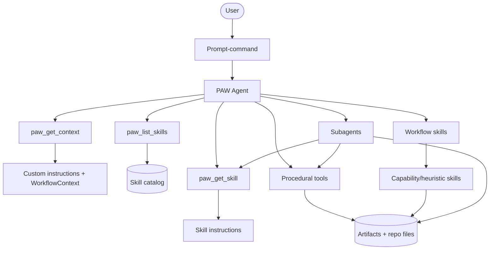
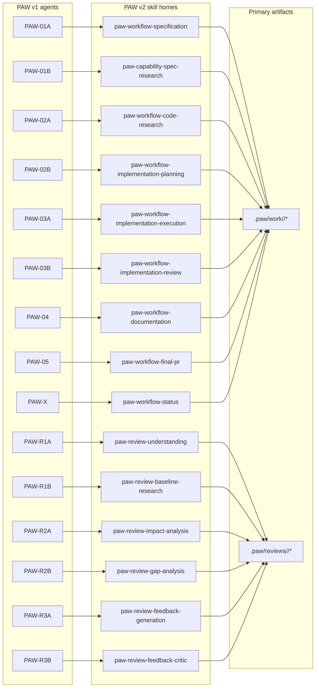
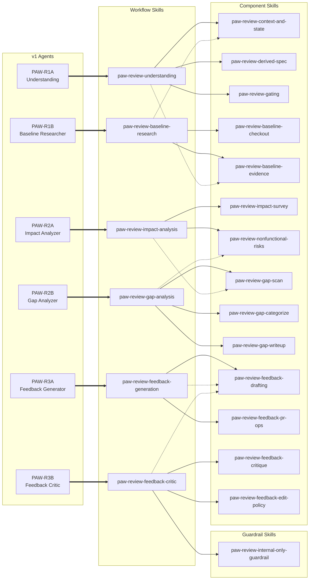

# GoDo-2 (v2): Control Plane + Taxonomy (Agent vs Skills vs Tools vs Prompt-Commands)

> Alternative implementation doc. Do not compare to or rely on the earlier GoDo-2 docs.
> Goal: define PAW v2 control plane taxonomy and provide a concrete mapping from v1 agents to v2 skills.

## Scope (this doc)

- Define a simple taxonomy:
  - **PAW Agent** (single top-level orchestrator)
  - **Skills** (workflow + capability)
  - **Tools** (procedural ops)
  - **Prompt-commands** (user entrypoints)
- Map each v1 agent in `agents/` to its v2 skill “home” (workflow vs capability).
- Produce visuals (Mermaid) that make the system legible.

## Constraints

- VS Code + Copilot centric for v2 MVP.
- Skills are the primary encoding of workflow semantics.
- Tools are procedural substrate; decisions live in the PAW Agent + skills.
- Subagents are used to reduce context load; subagents load skills via tool calls.

---

## Taxonomy

### 1) PAW Agent (single top-level)

Responsibilities (draft):
- Work item awareness: identify work id, stage, artifacts.
- Skill orchestration: select and sequence skills.
- Handoff + context reset decisions (manual / semi-auto / auto modes).
- Subagent invocation: delegate bounded tasks; ensure artifacts are written.
- Guardrails: enforce precedence rules (workspace > user > defaults) for instructions.

Non-responsibilities (draft):
- Not the primary place where phase instructions live.
- Not a dumping ground for templates; those belong in skills/prompt-commands.

### 2) Skills

Types:
- **Workflow skills**: stage/phase sequences + quality gates + artifact expectations.
- **Capability skills**: reusable behaviors (e.g., “write spec”, “code research”, “impact analysis”).
- **Heuristic skills**: judgment frameworks (e.g., review rubric, scope cutting).

### 3) Tools

Tools provide procedural operations and I/O, e.g.:
- read workspace state
- generate prompt files
- open new chat / handoff
- list skills / read skill content
- GitHub MCP (issues/PRs)

### 4) Prompt-commands

Prompt files become the explicit verbs users learn, e.g.:
- `paw-create-spec`
- `paw-create-plan`
- `paw-implement`
- `paw-review-pr`
- `paw-status`

A prompt-command:
- targets the PAW Agent
- instructs it to load and execute a workflow skill
- may accept user-provided parameters

---

## Agent → Skill Mapping

### Mapping table layout

Conventions:
- **Workflow skill** = stage/phase sequencing + artifact contract.
- **Component skills (coarse / loadable)** = reusable modules a model may selectively load to keep the workflow skill short and avoid bloating the PAW Agent instructions.
- **Granules (fine)** = internal sub-behaviors that can be templated inside component skills; not intended to be independently selected by the model.
- **Artifacts** = concrete files written to `.paw/…`.

| v1 Agent File | Primary v2 Skill Home | Skill Type (workflow/capability/heuristic) | Component Skills (coarse / loadable; when & why) | Granules (fine; mapped into coarse components) | Key Artifacts / Outputs | Notes |
|---|---|---|---|---|---|---|
| agents/PAW-01A Specification.agent.md | paw-workflow-specification | workflow | paw-spec-authoring (load while drafting); paw-spec-quality-gates (load before finalizing); paw-spec-research-bridge (load when deciding if research is needed); paw-heuristic-classify-unknowns (load when blocked by ambiguity) | write-spec; user-story-slicing; spec-traceability; spec-quality-gate; generate-spec-research-prompt | `.paw/work/<work-id>/Spec.md`; `.paw/work/<work-id>/prompts/01B-spec-research.prompt.md` | Strong “no implementation details” guardrail; explicit pause for research if needed. |
| agents/PAW-01B Spec Researcher.agent.md | paw-capability-spec-research | capability | paw-spec-research-evidence (load to extract behavior evidence); paw-spec-research-writeup (load to structure output); paw-guardrails-spec-research (load to keep output non-design/non-implementation) | behavioral-evidence-extraction; specresearch-md-writer; no-design-no-eval; no-implementation-details | `.paw/work/<work-id>/SpecResearch.md` | Behavioral “how system works today”; explicitly separated from code-structure research. |
| agents/PAW-02A Code Researcher.agent.md | paw-workflow-code-research | workflow | paw-code-research-discovery (load to find entrypoints); paw-code-research-tracing (load for call/path tracing); paw-code-research-evidence-links (load to add file/line permalinks); paw-guardrails-neutral-documentarian (load to keep tone neutral) | codebase-discovery; code-path-tracing; pattern-mining; permalink-enrichment; neutral-documentarian | `.paw/work/<work-id>/CodeResearch.md` | Evidence-heavy with file/line references; no critique unless asked. |
| agents/PAW-02B Impl Planner.agent.md | paw-workflow-implementation-planning | workflow | paw-plan-structure-and-phases (load to produce a phase plan); paw-plan-success-criteria (load to define “done”); paw-plan-tests (load to co-design tests); paw-plan-pr-ops (load only in `prs` mode); paw-plan-review-comment-triage (load when plan responds to review feedback) | phase-structuring; success-criteria-authoring; test-co-design; planning-pr-management; review-comment-triage | `.paw/work/<work-id>/ImplementationPlan.md` (+ planning PR when `prs`) | Includes both planning and “planning PR review response” sub-mode. |
| agents/PAW-03A Implementer.agent.md | paw-workflow-implementation-execution | workflow | paw-impl-phase-selection (load at each iteration to pick next phase); paw-impl-branch-and-staging-policy (load when touching git/commits); paw-impl-verification-and-blocking (load before/after edits to run checks + stop on mismatch) | select-next-plan-phase; branch-strategy; selective-staging; run-success-checks; block-on-mismatch | Code changes + commits; updates to ImplementationPlan checkboxes/notes | Explicit separation of duties: implementer does code+commits; reviewer does push/PR ops. |
| agents/PAW-03B Impl Reviewer.agent.md | paw-workflow-implementation-review | workflow | paw-impl-review-quality-gates (load to assess maintainability/tests); paw-impl-review-pr-ops (load only in `prs` mode); paw-impl-review-summarize (load to produce PR/phase summaries) | maintainability-review; test-gatekeeper; phase-pr-create-update; pr-summary-comment | Phase PRs (`prs`); updates to ImplementationPlan links/notes | Encodes a mini “policy engine” driven by Review Strategy (`prs` vs `local`). |
| agents/PAW-04 Documenter.agent.md | paw-workflow-documentation | workflow | paw-docs-authoring (load when writing docs); paw-docs-project-conventions (load to match repo style); paw-docs-pr-ops (load only in `prs` mode); paw-docs-review-comment-batching (load when handling doc feedback) | authoritative-docs-writer; project-docs-update; docs-pr-management; review-comment-batching | `.paw/work/<work-id>/Docs.md`; docs PR when `prs` | Guardrail: do not change implementation code/tests during docs stage. |
| agents/PAW-05 PR.agent.md | paw-workflow-final-pr | workflow | paw-final-pr-preflight (load to validate readiness); paw-final-pr-compose (load to draft title/description); paw-heuristic-mode-strategy-pr-template (load to adapt to repo PR template + workflow mode) | preflight-readiness; pr-title-compose; pr-description-compose; mode-strategy-pr-template | Final PR (platform object) + handoff message | Strict “no edits/merges/review handling”; blocks unless user overrides. |
| agents/PAW-R1A Understanding.agent.md | paw-review-understanding | workflow | paw-review-context-and-state (load to collect metadata + state); paw-review-derived-spec (load to derive expected behavior); paw-review-gating (load to enforce baseline requirements) | context-detect-state; context-collect-metadata; baseline-prompt-generate; derivedspec-derive; discrepancy-block | `.paw/reviews/<id>/ReviewContext.md`; `.paw/reviews/<id>/DerivedSpec.md`; `.paw/reviews/<id>/prompts/01B-code-research.prompt.md` | Hard gate: do not proceed without baseline CodeResearch once a baseline prompt exists. |
| agents/PAW-R1B Baseline Researcher.agent.md | paw-review-baseline-research | workflow | paw-review-baseline-checkout (load to operate at base commit safely); paw-review-baseline-evidence (load to write baseline behavior + coderesearch) | context-parse; git-checkout-restore-base; baseline-behavior-doc; coderesearch-writer | `.paw/reviews/<id>/CodeResearch.md` | Operates at base commit only; must restore original branch. |
| agents/PAW-R2A Impact Analyzer.agent.md | paw-review-impact-analysis | workflow | paw-review-impact-survey (load for one-hop integration graph + breaking change scan); paw-review-nonfunctional-risks (load for security/perf/deploy analysis) | integration-graph-one-hop; detect-breaking-changes; assess-security; assess-performance; assess-deploy-migrations | `.paw/reviews/<id>/ImpactAnalysis.md` | System-wide; bounded dependency discovery (“one hop”). |
| agents/PAW-R2B Gap Analyzer.agent.md | paw-review-gap-analysis | workflow | paw-review-gap-scan (load to detect correctness/security/tests/maint gaps); paw-review-gap-categorize (load to must/should/could); paw-review-gap-writeup (load to format the report + anti-inflation rules) | correctness-scan; security-scan; test-coverage-parse; maintainability-scan; categorize-must-should-could; gap-report-writer | `.paw/reviews/<id>/GapAnalysis.md` | Anti-inflation rules; counts + fixed template; positive observations included. |
| agents/PAW-R3A Feedback Generator.agent.md | paw-review-feedback-generation | workflow | paw-review-feedback-drafting (load to structure comment objects + rationale); paw-review-feedback-pr-ops (load to create pending review + post comments safely) | one-issue-one-comment; comment-objects; rationale-writer; pending-review-create; pending-review-post-comments | `.paw/reviews/<id>/ReviewComments.md` (+ pending GitHub review) | Public comment text excludes internal rationale; draft-only (never auto-submit). |
| agents/PAW-R3B Feedback Critic.agent.md | paw-review-feedback-critic | workflow | paw-review-feedback-critique (load to rate usefulness/accuracy/tradeoffs); paw-review-feedback-edit-policy (load to decide include/modify/skip); paw-review-internal-only-guardrail (load to prevent public posting) | comment-usefulness-rating; accuracy-verification; tradeoff-analysis; include-modify-skip-decision; internal-only-guardrail | Updates `.paw/reviews/<id>/ReviewComments.md` | Advisory-only; assessments must never be posted publicly. |
| agents/PAW-X Status.agent.md | paw-workflow-status | workflow | paw-status-snapshot (load to gather state + matrices); paw-status-recommendations (load to suggest next steps); paw-status-publish (load only if user opts into GitHub posting) | work-item-index; artifact-presence-matrix; git-state-snapshot; pr-resolution; next-step-recommender; opt-in-github-poster | Status report (chat); optional GitHub issue/PR comment updates | Splits naturally into “state detection” vs “user education/reference”. |

### Candidate v2 skill ids (normalized)

These are candidate skill ids aligned to Agent Skills naming constraints (lowercase + hyphens). The mapping table above uses these as the “primary home” per v1 agent.

Workflow skills (stage orchestration):

- `paw-workflow-specification`
- `paw-workflow-code-research`
- `paw-workflow-implementation-planning`
- `paw-workflow-implementation-execution`
- `paw-workflow-implementation-review`
- `paw-workflow-documentation`
- `paw-workflow-final-pr`
- `paw-workflow-status`

Review workflow skills:

- `paw-review-understanding`
- `paw-review-baseline-research`
- `paw-review-impact-analysis`
- `paw-review-gap-analysis`
- `paw-review-feedback-generation`
- `paw-review-feedback-critic`

Common capability/heuristic skills (reused across workflows):

- `paw-capability-write-spec`
- `paw-capability-spec-research`
- `paw-capability-code-path-tracing`
- `paw-capability-pattern-mining`
- `paw-capability-phase-structuring`
- `paw-capability-success-criteria-authoring`
- `paw-capability-test-co-design`
- `paw-capability-selective-staging`
- `paw-capability-preflight-readiness`
- `paw-heuristic-mode-strategy-policy`

Recommended component skill groups (coarse granularity; model-selectable):

- `paw-spec-authoring`
- `paw-spec-quality-gates`
- `paw-spec-research-bridge`
- `paw-spec-research-evidence`
- `paw-spec-research-writeup`
- `paw-code-research-discovery`
- `paw-code-research-tracing`
- `paw-code-research-evidence-links`
- `paw-plan-structure-and-phases`
- `paw-plan-success-criteria`
- `paw-plan-tests`
- `paw-plan-pr-ops`
- `paw-plan-review-comment-triage`
- `paw-impl-phase-selection`
- `paw-impl-branch-and-staging-policy`
- `paw-impl-verification-and-blocking`
- `paw-impl-review-quality-gates`
- `paw-impl-review-pr-ops`
- `paw-impl-review-summarize`
- `paw-docs-authoring`
- `paw-docs-project-conventions`
- `paw-docs-pr-ops`
- `paw-docs-review-comment-batching`
- `paw-final-pr-preflight`
- `paw-final-pr-compose`
- `paw-review-context-and-state`
- `paw-review-derived-spec`
- `paw-review-gating`
- `paw-review-baseline-checkout`
- `paw-review-baseline-evidence`
- `paw-review-impact-survey`
- `paw-review-nonfunctional-risks`
- `paw-review-gap-scan`
- `paw-review-gap-categorize`
- `paw-review-gap-writeup`
- `paw-review-feedback-drafting`
- `paw-review-feedback-pr-ops`
- `paw-review-feedback-critique`
- `paw-review-feedback-edit-policy`
- `paw-status-snapshot`
- `paw-status-recommendations`
- `paw-status-publish`

---

## Visuals

### Control plane overview

### v1 agents → v2 skills mapping (high-level)

### Implementation workflow: agents → skills (detailed)

```mermaid
flowchart LR
  subgraph agents[v1 Agents]
    a01a[PAW-01A<br/>Specification]
    a01b[PAW-01B<br/>Spec Researcher]
    a02a[PAW-02A<br/>Code Researcher]
    a02b[PAW-02B<br/>Impl Planner]
    a03a[PAW-03A<br/>Implementer]
    a03b[PAW-03B<br/>Impl Reviewer]
    a04[PAW-04<br/>Documenter]
    a05[PAW-05<br/>PR]
    ax[PAW-X<br/>Status]
  end

  subgraph workflow[Workflow Skills]
    wf_spec[paw-workflow-specification]
    wf_cr[paw-workflow-code-research]
    wf_plan[paw-workflow-implementation-planning]
    wf_impl[paw-workflow-implementation-execution]
    wf_rev[paw-workflow-implementation-review]
    wf_docs[paw-workflow-documentation]
    wf_pr[paw-workflow-final-pr]
    wf_status[paw-workflow-status]
  end

  subgraph primarycap[Primary Capability Skills]
    cap_specr[paw-capability-spec-research]
  end

  subgraph components[Component Skills]
    %% Spec
    cs_spec_author[paw-spec-authoring]
    cs_spec_gates[paw-spec-quality-gates]
    cs_spec_bridge[paw-spec-research-bridge]

    %% Spec research
    cs_specr_evidence[paw-spec-research-evidence]
    cs_specr_writeup[paw-spec-research-writeup]

    %% Code research
    cs_cr_discovery[paw-code-research-discovery]
    cs_cr_tracing[paw-code-research-tracing]
    cs_cr_links[paw-code-research-evidence-links]

    %% Planning
    cs_plan_phases[paw-plan-structure-and-phases]
    cs_plan_success[paw-plan-success-criteria]
    cs_plan_tests[paw-plan-tests]
    cs_plan_pr[paw-plan-pr-ops]
    cs_plan_triage[paw-plan-review-comment-triage]

    %% Implementation execution
    cs_impl_select[paw-impl-phase-selection]
    cs_impl_git[paw-impl-branch-and-staging-policy]
    cs_impl_verify[paw-impl-verification-and-blocking]

    %% Implementation review
    cs_rev_gates[paw-impl-review-quality-gates]
    cs_rev_pr[paw-impl-review-pr-ops]
    cs_rev_summary[paw-impl-review-summarize]

    %% Docs
    cs_docs_author[paw-docs-authoring]
    cs_docs_style[paw-docs-project-conventions]
    cs_docs_pr[paw-docs-pr-ops]
    cs_docs_batch[paw-docs-review-comment-batching]

    %% Final PR
    cs_pr_preflight[paw-final-pr-preflight]
    cs_pr_compose[paw-final-pr-compose]

    %% Status
    cs_status_snap[paw-status-snapshot]
    cs_status_next[paw-status-recommendations]
    cs_status_pub[paw-status-publish]
  end

  subgraph heuristic[Heuristic Skills]
    h_classify[paw-heuristic-classify-unknowns]
    h_mode_pr[paw-heuristic-mode-strategy-pr-template]
  end

  subgraph guardrail[Guardrail Skills]
    g_no_design[paw-guardrail-no-design-no-eval]
    g_no_impl[paw-guardrail-no-implementation-details]
    g_neutral[paw-guardrail-neutral-documentarian]
  end

  %% Agent → Primary Workflow Skill
  a01a ==> wf_spec
  a01b ==> cap_specr
  a02a ==> wf_cr
  a02b ==> wf_plan
  a03a ==> wf_impl
  a03b ==> wf_rev
  a04 ==> wf_docs
  a05 ==> wf_pr
  ax ==> wf_status

  %% Workflow → Component (coarse) decomposition
  wf_spec --> cs_spec_author
  wf_spec --> cs_spec_gates
  wf_spec --> cs_spec_bridge
  wf_spec --> h_classify
  wf_spec --> g_no_impl

  cap_specr --> cs_specr_evidence
  cap_specr --> cs_specr_writeup
  cap_specr --> g_no_design
  cap_specr --> g_no_impl

  wf_cr --> cs_cr_discovery
  wf_cr --> cs_cr_tracing
  wf_cr --> cs_cr_links
  wf_cr --> g_neutral

  wf_plan --> cs_plan_phases
  wf_plan --> cs_plan_success
  wf_plan --> cs_plan_tests
  wf_plan --> cs_plan_pr
  wf_plan --> cs_plan_triage

  wf_impl --> cs_impl_select
  wf_impl --> cs_impl_git
  wf_impl --> cs_impl_verify

  wf_rev --> cs_rev_gates
  wf_rev --> cs_rev_pr
  wf_rev --> cs_rev_summary

  wf_docs --> cs_docs_author
  wf_docs --> cs_docs_style
  wf_docs --> cs_docs_pr
  wf_docs --> cs_docs_batch

  wf_pr --> cs_pr_preflight
  wf_pr --> cs_pr_compose
  wf_pr --> h_mode_pr

  wf_status --> cs_status_snap
  wf_status --> cs_status_next
  wf_status --> cs_status_pub

  %% Cross-workflow shared component skills (many-to-many)
  wf_plan -.-> cs_plan_triage
  wf_docs -.-> cs_plan_triage
  wf_rev -.-> cs_plan_triage

  wf_impl -.-> cs_impl_verify
  wf_rev -.-> cs_impl_verify

  wf_plan -.-> cs_plan_tests
  wf_impl -.-> cs_plan_tests

  wf_rev -.-> cs_rev_summary
  wf_pr -.-> cs_rev_summary
```

### Review workflow: agents → skills (detailed)

---

## Decisions to lock (fill in)

- Where workflow sequencing lives (skill vs agent):
- What becomes a prompt-command vs an implicit skill:
- Skill catalog loading strategy (single tool vs list/get split):
- Precedence rules across builtin/user/workspace/work-item:

---

## Open questions

- Can handoff reliably invoke a prompt-command as the first message in the new chat?
- What is the minimum stable contract for subagent outputs (paths + summary + status)?
