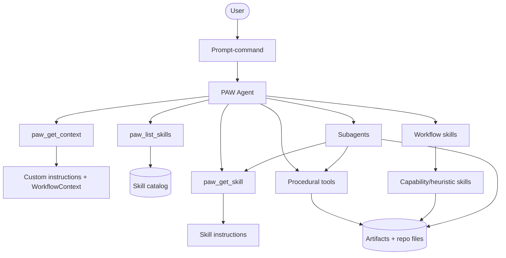
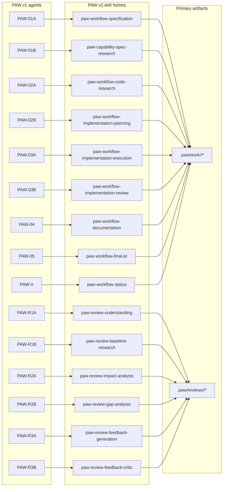

# GoDo-2 (v2): Control Plane + Taxonomy (Agent vs Skills vs Tools vs Prompt-Commands)

> Alternative implementation doc. Do not compare to or rely on the earlier GoDo-2 docs.
> Goal: define PAW v2 control plane taxonomy and provide a concrete mapping from v1 agents to v2 skills.

## Scope (this doc)

- Define a simple taxonomy:
  - **PAW Agent** (single top-level orchestrator)
  - **Skills** (workflow + capability)
  - **Tools** (procedural ops)
  - **Prompt-commands** (user entrypoints)
- Map each v1 agent in `agents/` to its v2 skill “home” (workflow vs capability).
- Produce visuals (Mermaid) that make the system legible.

## Constraints

- VS Code + Copilot centric for v2 MVP.
- Skills are the primary encoding of workflow semantics.
- Tools are procedural substrate; decisions live in the PAW Agent + skills.
- Subagents are used to reduce context load; subagents load skills via tool calls.

---

## Taxonomy

### 1) PAW Agent (single top-level)

Responsibilities (draft):
- Work item awareness: identify work id, stage, artifacts.
- Skill orchestration: select and sequence skills.
- Handoff + context reset decisions (manual / semi-auto / auto modes).
- Subagent invocation: delegate bounded tasks; ensure artifacts are written.
- Guardrails: enforce precedence rules (workspace > user > defaults) for instructions.

Non-responsibilities (draft):
- Not the primary place where phase instructions live.
- Not a dumping ground for templates; those belong in skills/prompt-commands.

### 2) Skills

Types:
- **Workflow skills**: stage/phase sequences + quality gates + artifact expectations.
- **Capability skills**: reusable behaviors (e.g., “write spec”, “code research”, “impact analysis”).
- **Heuristic skills**: judgment frameworks (e.g., review rubric, scope cutting).

### 3) Tools

Tools provide procedural operations and I/O, e.g.:
- read workspace state
- generate prompt files
- open new chat / handoff
- list skills / read skill content
- GitHub MCP (issues/PRs)

### 4) Prompt-commands

Prompt files become the explicit verbs users learn, e.g.:
- `paw-create-spec`
- `paw-create-plan`
- `paw-implement`
- `paw-review-pr`
- `paw-status`

A prompt-command:
- targets the PAW Agent
- instructs it to load and execute a workflow skill
- may accept user-provided parameters

---

## Agent → Skill Mapping

### Mapping table layout

Conventions:
- **Workflow skill** = phase orchestration.
- **Capability skill** = reusable action.
- **Artifacts** = concrete files written to `.paw/…`.

| v1 Agent File | Primary v2 Skill Home | Skill Type (workflow/capability/heuristic) | Decomposable Component Skills (examples) | Key Artifacts / Outputs | Notes |
|---|---|---|---|---|---|
| agents/PAW-01A Specification.agent.md | paw-workflow-specification | workflow | paw-capability-write-spec; paw-capability-user-story-slicing; paw-capability-spec-traceability; paw-capability-spec-quality-gate; paw-capability-generate-spec-research-prompt; paw-heuristic-classify-unknowns | `.paw/work/<work-id>/Spec.md`; `.paw/work/<work-id>/prompts/01B-spec-research.prompt.md` | Strong “no implementation details” guardrail; explicit pause for research if needed. |
| agents/PAW-01B Spec Researcher.agent.md | paw-capability-spec-research | capability | paw-capability-behavioral-evidence-extraction; paw-capability-specresearch-md-writer; paw-guardrail-no-design-no-eval; paw-guardrail-no-implementation-details | `.paw/work/<work-id>/SpecResearch.md` | Behavioral “how system works today”; explicitly separated from code-structure research. |
| agents/PAW-02A Code Researcher.agent.md | paw-workflow-code-research | workflow | paw-capability-codebase-discovery; paw-capability-code-path-tracing; paw-capability-pattern-mining; paw-capability-permalink-enrichment; paw-guardrail-neutral-documentarian | `.paw/work/<work-id>/CodeResearch.md` | Evidence-heavy with file/line references; no critique unless asked. |
| agents/PAW-02B Impl Planner.agent.md | paw-workflow-implementation-planning | workflow | paw-capability-phase-structuring; paw-capability-success-criteria-authoring; paw-capability-test-co-design; paw-capability-review-comment-triage; paw-capability-planning-pr-management | `.paw/work/<work-id>/ImplementationPlan.md` (+ planning PR when `prs`) | Includes both planning and “planning PR review response” sub-mode. |
| agents/PAW-03A Implementer.agent.md | paw-workflow-implementation-execution | workflow | paw-capability-select-next-plan-phase; paw-capability-branch-strategy; paw-capability-run-success-checks; paw-capability-selective-staging; paw-capability-block-on-mismatch | Code changes + commits; updates to ImplementationPlan checkboxes/notes | Explicit separation of duties: implementer does code+commits; reviewer does push/PR ops. |
| agents/PAW-03B Impl Reviewer.agent.md | paw-workflow-implementation-review | workflow | paw-capability-maintainability-review; paw-capability-test-gatekeeper; paw-capability-phase-pr-create-update; paw-capability-pr-summary-comment | Phase PRs (`prs`); updates to ImplementationPlan links/notes | Encodes a mini “policy engine” driven by Review Strategy (`prs` vs `local`). |
| agents/PAW-04 Documenter.agent.md | paw-workflow-documentation | workflow | paw-capability-authoritative-docs-writer; paw-capability-project-docs-update; paw-capability-docs-pr-management; paw-capability-review-comment-batching | `.paw/work/<work-id>/Docs.md`; docs PR when `prs` | Guardrail: do not change implementation code/tests during docs stage. |
| agents/PAW-05 PR.agent.md | paw-workflow-final-pr | workflow | paw-capability-preflight-readiness; paw-capability-pr-title-compose; paw-capability-pr-description-compose; paw-heuristic-mode-strategy-pr-template | Final PR (platform object) + handoff message | Strict “no edits/merges/review handling”; blocks unless user overrides. |
| agents/PAW-R1A Understanding.agent.md | paw-review-understanding | workflow | paw-review-context-detect-state; paw-review-context-collect-metadata; paw-review-baseline-prompt-generate; paw-review-derivedspec-derive; paw-review-discrepancy-block | `.paw/reviews/<id>/ReviewContext.md`; `.paw/reviews/<id>/DerivedSpec.md`; `.paw/reviews/<id>/prompts/01B-code-research.prompt.md` | Hard gate: do not proceed without baseline CodeResearch once a baseline prompt exists. |
| agents/PAW-R1B Baseline Researcher.agent.md | paw-review-baseline-research | workflow | paw-review-context-parse; paw-git-checkout-restore-base; paw-review-baseline-behavior-doc; paw-review-coderesearch-writer | `.paw/reviews/<id>/CodeResearch.md` | Operates at base commit only; must restore original branch. |
| agents/PAW-R2A Impact Analyzer.agent.md | paw-review-impact-analysis | workflow | paw-review-integration-graph-one-hop; paw-review-detect-breaking-changes; paw-review-assess-security; paw-review-assess-performance; paw-review-assess-deploy-migrations | `.paw/reviews/<id>/ImpactAnalysis.md` | System-wide; bounded dependency discovery (“one hop”). |
| agents/PAW-R2B Gap Analyzer.agent.md | paw-review-gap-analysis | workflow | paw-review-correctness-scan; paw-review-security-scan; paw-review-test-coverage-parse; paw-review-maintainability-scan; paw-review-categorize-must-should-could; paw-review-gap-report-writer | `.paw/reviews/<id>/GapAnalysis.md` | Anti-inflation rules; counts + fixed template; positive observations included. |
| agents/PAW-R3A Feedback Generator.agent.md | paw-review-feedback-generation | workflow | paw-review-one-issue-one-comment; paw-review-comment-objects; paw-review-rationale-writer; paw-review-pending-review-create; paw-review-pending-review-post-comments | `.paw/reviews/<id>/ReviewComments.md` (+ pending GitHub review) | Public comment text excludes internal rationale; draft-only (never auto-submit). |
| agents/PAW-R3B Feedback Critic.agent.md | paw-review-feedback-critic | workflow | paw-review-comment-usefulness-rating; paw-review-accuracy-verification; paw-review-tradeoff-analysis; paw-review-include-modify-skip-decision; paw-review-internal-only-guardrail | Updates `.paw/reviews/<id>/ReviewComments.md` | Advisory-only; assessments must never be posted publicly. |
| agents/PAW-X Status.agent.md | paw-workflow-status | workflow | paw-status-work-item-index; paw-status-artifact-presence-matrix; paw-status-git-state-snapshot; paw-status-pr-resolution; paw-status-next-step-recommender; paw-status-opt-in-github-poster | Status report (chat); optional GitHub issue/PR comment updates | Splits naturally into “state detection” vs “user education/reference”. |

### Candidate v2 skill ids (normalized)

These are candidate skill ids aligned to Agent Skills naming constraints (lowercase + hyphens). The mapping table above uses these as the “primary home” per v1 agent.

Workflow skills (stage orchestration):

- `paw-workflow-specification`
- `paw-workflow-code-research`
- `paw-workflow-implementation-planning`
- `paw-workflow-implementation-execution`
- `paw-workflow-implementation-review`
- `paw-workflow-documentation`
- `paw-workflow-final-pr`
- `paw-workflow-status`

Review workflow skills:

- `paw-review-understanding`
- `paw-review-baseline-research`
- `paw-review-impact-analysis`
- `paw-review-gap-analysis`
- `paw-review-feedback-generation`
- `paw-review-feedback-critic`

Common capability/heuristic skills (reused across workflows):

- `paw-capability-write-spec`
- `paw-capability-spec-research`
- `paw-capability-code-path-tracing`
- `paw-capability-pattern-mining`
- `paw-capability-phase-structuring`
- `paw-capability-success-criteria-authoring`
- `paw-capability-test-co-design`
- `paw-capability-selective-staging`
- `paw-capability-preflight-readiness`
- `paw-heuristic-mode-strategy-policy`

---

## Visuals

### Control plane overview

### v1 agents → v2 skills mapping (high-level)

---

## Decisions to lock (fill in)

- Where workflow sequencing lives (skill vs agent):
- What becomes a prompt-command vs an implicit skill:
- Skill catalog loading strategy (single tool vs list/get split):
- Precedence rules across builtin/user/workspace/work-item:

---

## Open questions

- Can handoff reliably invoke a prompt-command as the first message in the new chat?
- What is the minimum stable contract for subagent outputs (paths + summary + status)?
