# GoDo-2 (v3): Control Plane + Taxonomy (Agent vs Skills vs Tools vs Prompt-Commands)

> **Status:** Draft v3 (Consolidated & Critiqued)
> **Goal:** Define the PAW v2 control plane taxonomy, map v1 agents to v2 skills, and establish the architecture for the agent/skill/tool interaction.

## Scope

- Define a clear taxonomy:
  - **PAW Agent** (single top-level orchestrator)
  - **Skills** (workflow + capability + cross-cutting)
  - **Tools** (procedural ops)
  - **Prompt-commands** (user entrypoints)
- Map each v1 agent in `agents/` to its v2 skill “home” (workflow vs capability).
- Define cross-cutting skills that are shared across workflows.
- Produce visuals (Mermaid) that make the system legible.

## Constraints

- **VS Code + Copilot centric** for v2 MVP.
- **Skills** are the primary encoding of workflow semantics.
- **Tools** are the procedural substrate; decisions live in the PAW Agent + skills.
- **Subagents** are used to reduce context load; subagents load skills via tool calls.

---

## Taxonomy

### Overview

| Component | Definition | Responsibilities |
|-----------|------------|------------------|
| **PAW Agent** | Single top-level agent | Workflow state awareness, skill orchestration, handoff decisions, subagent invocation |
| **Workflow Skills** | Phase orchestration instructions | Stage-specific workflows, artifact templates, quality gates |
| **Capability Skills** | Reusable behavior instructions | Research patterns, review heuristics, artifact conventions (no state mutation) |
| **Cross-Cutting Skills** | Shared conventions & patterns | Shared logic used by multiple workflow/capability skills |
| **Tools** | Procedural operations | `paw_get_context`, `paw_list_skills`, `paw_get_skill`, `paw_call_agent`, `paw_generate_prompt` |
| **Prompt Commands** | User-initiated entry points | Explicit verbs: "create spec", "create plan", "run review" |

### 1) PAW Agent (single top-level)

**Responsibilities:**
- **Work item awareness:** identify work id, stage, artifacts.
- **Skill orchestration:** select and sequence skills.
- **Handoff + context reset decisions:** (manual / semi-auto / auto modes).
- **Subagent invocation:** delegate bounded tasks; ensure artifacts are written.
- **Guardrails:** enforce precedence rules (workspace > user > defaults) for instructions.

**Non-responsibilities:**
- Not the primary place where phase instructions live.
- Not a dumping ground for templates; those belong in skills/prompt-commands.

### 2) Skills

Types:
- **Workflow skills**: stage/phase sequences + quality gates + artifact expectations.
- **Capability skills**: reusable behaviors (e.g., “write spec”, “code research”, “impact analysis”).
- **Cross-Cutting skills**: shared conventions, patterns, and integrations.
- **Heuristic skills**: judgment frameworks (e.g., review rubric, scope cutting).

### 3) Tools

Tools provide procedural operations and I/O, e.g.:
- read workspace state
- generate prompt files
- open new chat / handoff
- list skills / read skill content
- GitHub MCP (issues/PRs)

### 4) Prompt-commands

Prompt files become the explicit verbs users learn, e.g.:
- `paw-create-spec`
- `paw-create-plan`
- `paw-implement`
- `paw-review-pr`
- `paw-status`

A prompt-command:
- targets the PAW Agent
- instructs it to load and execute a workflow skill
- may accept user-provided parameters

---

## Agent → Skill Mapping

### Implementation Workflow

| v1 Agent | v2 Skill Name | Core Responsibilities | Decomposable Skills (examples) | Artifacts | Notes / Guardrails |
|---|---|---|---|---|---|
| `PAW-01A Specification` | `paw-workflow-specification` | Convert feature briefs/Issues into structured specs; generate research prompts for unknowns | `paw-capability-write-spec`; `paw-capability-user-story-slicing`; `paw-capability-spec-traceability`; `paw-capability-spec-quality-gate`; `paw-capability-generate-spec-research-prompt`; `paw-heuristic-classify-unknowns` | `.paw/work/<work-id>/Spec.md`; `.paw/work/<work-id>/prompts/01B-spec-research.prompt.md` | Strong “no implementation details” guardrail; explicit pause for research if needed. |
| `PAW-01B Spec Researcher` | `paw-capability-spec-research` | Document existing system behavioral patterns (what, not how) | `paw-capability-behavioral-evidence-extraction`; `paw-capability-specresearch-md-writer`; `paw-guardrail-no-design-no-eval`; `paw-guardrail-no-implementation-details` | `.paw/work/<work-id>/SpecResearch.md` | Behavioral “how system works today”; explicitly separated from code-structure research. |
| `PAW-02A Code Researcher` | `paw-workflow-code-research` | Document implementation with file:line references; map architecture | `paw-capability-codebase-discovery`; `paw-capability-code-path-tracing`; `paw-capability-pattern-mining`; `paw-capability-permalink-enrichment`; `paw-guardrail-neutral-documentarian` | `.paw/work/<work-id>/CodeResearch.md` | Evidence-heavy with file/line references; no critique unless asked. |
| `PAW-02B Impl Planner` | `paw-workflow-implementation-planning` | Create multi-phase implementation plans; define success criteria | `paw-capability-phase-structuring`; `paw-capability-success-criteria-authoring`; `paw-capability-test-co-design`; `paw-capability-review-comment-triage`; `paw-capability-planning-pr-management` | `.paw/work/<work-id>/ImplementationPlan.md` (+ planning PR) | Includes both planning and “planning PR review response” sub-mode. |
| `PAW-03A Implementer` | `paw-workflow-implementation-execution` | Execute implementation plan phases; run verification; commit locally | `paw-capability-select-next-plan-phase`; `paw-capability-branch-strategy`; `paw-capability-run-success-checks`; `paw-capability-selective-staging`; `paw-capability-block-on-mismatch` | Code changes + commits; updates to ImplementationPlan | Explicit separation of duties: implementer does code+commits; reviewer does push/PR ops. |
| `PAW-03B Impl Reviewer` | `paw-workflow-implementation-review` | Review implementation quality; add docstrings; push branches | `paw-capability-maintainability-review`; `paw-capability-test-gatekeeper`; `paw-capability-phase-pr-create-update`; `paw-capability-pr-summary-comment` | Phase PRs (`prs`); updates to ImplementationPlan | Encodes a mini “policy engine” driven by Review Strategy (`prs` vs `local`). |
| `PAW-04 Documenter` | `paw-workflow-documentation` | Create `Docs.md` as authoritative reference; update project docs | `paw-capability-authoritative-docs-writer`; `paw-capability-project-docs-update`; `paw-capability-docs-pr-management`; `paw-capability-review-comment-batching` | `.paw/work/<work-id>/Docs.md`; docs PR | Guardrail: do not change implementation code/tests during docs stage. |
| `PAW-05 PR` | `paw-workflow-final-pr` | Run pre-flight validation; craft PR description; create final PR | `paw-capability-preflight-readiness`; `paw-capability-pr-title-compose`; `paw-capability-pr-description-compose`; `paw-heuristic-mode-strategy-pr-template` | Final PR (platform object) + handoff message | Strict “no edits/merges/review handling”; blocks unless user overrides. |

### Review Workflow

| v1 Agent | v2 Skill Name | Core Responsibilities | Decomposable Skills (examples) | Artifacts | Notes / Guardrails |
|---|---|---|---|---|---|
| `PAW-R1A Understanding` | `paw-review-understanding` | Gather PR metadata; generate baseline research prompt; derive spec | `paw-review-context-detect-state`; `paw-review-context-collect-metadata`; `paw-review-baseline-prompt-generate`; `paw-review-derivedspec-derive`; `paw-review-discrepancy-block` | `.paw/reviews/<id>/ReviewContext.md`; `.paw/reviews/<id>/DerivedSpec.md` | Hard gate: do not proceed without baseline CodeResearch once a baseline prompt exists. |
| `PAW-R1B Baseline Researcher` | `paw-review-baseline-research` | Checkout base commit; analyze pre-change codebase | `paw-review-context-parse`; `paw-git-checkout-restore-base`; `paw-review-baseline-behavior-doc`; `paw-review-coderesearch-writer` | `.paw/reviews/<id>/CodeResearch.md` | Operates at base commit only; must restore original branch. |
| `PAW-R2A Impact Analyzer` | `paw-review-impact-analysis` | Build integration graph; detect breaking changes; assess security | `paw-review-integration-graph-one-hop`; `paw-review-detect-breaking-changes`; `paw-review-assess-security`; `paw-review-assess-performance`; `paw-review-assess-deploy-migrations` | `.paw/reviews/<id>/ImpactAnalysis.md` | System-wide; bounded dependency discovery (“one hop”). |
| `PAW-R2B Gap Analyzer` | `paw-review-gap-analysis` | Identify correctness/logic errors; find safety/security vulnerabilities | `paw-review-correctness-scan`; `paw-review-security-scan`; `paw-review-test-coverage-parse`; `paw-review-maintainability-scan`; `paw-review-categorize-must-should-could` | `.paw/reviews/<id>/GapAnalysis.md` | Anti-inflation rules; counts + fixed template; positive observations included. |
| `PAW-R3A Feedback Generator` | `paw-review-feedback-generation` | Batch related findings; generate comprehensive rationale; create pending review | `paw-review-one-issue-one-comment`; `paw-review-comment-objects`; `paw-review-rationale-writer`; `paw-review-pending-review-create`; `paw-review-pending-review-post-comments` | `.paw/reviews/<id>/ReviewComments.md` (+ pending GitHub review) | Public comment text excludes internal rationale; draft-only (never auto-submit). |
| `PAW-R3B Feedback Critic` | `paw-review-feedback-critic` | Evaluate usefulness; validate evidence accuracy; recommend Include/Modify/Skip | `paw-review-comment-usefulness-rating`; `paw-review-accuracy-verification`; `paw-review-tradeoff-analysis`; `paw-review-include-modify-skip-decision` | Updates `.paw/reviews/<id>/ReviewComments.md` | Advisory-only; assessments must never be posted publicly. |

### Utility

| v1 Agent | v2 Skill Name | Core Responsibilities | Decomposable Skills (examples) | Artifacts | Notes / Guardrails |
|---|---|---|---|---|---|
| `PAW-X Status` | `paw-workflow-status` | State introspection; next-step guidance; agent dispatch | `paw-status-work-item-index`; `paw-status-artifact-presence-matrix`; `paw-status-git-state-snapshot`; `paw-status-pr-resolution`; `paw-status-next-step-recommender` | Status report (chat) | Splits naturally into “state detection” vs “user education/reference”. |

---

## Cross-Cutting Skills

These skills are factored out to be used by multiple workflow and capability skills.

| Skill Name | Description | Used By (Workflow Skills) |
|------------|-------------|---------------------------|
| `paw-review-heuristics` | Must/Should/Could severity system; evidence-based observations; positive recognition pattern | Impact Analysis, Gap Analysis, Feedback Generation, Impl Review |
| `paw-artifact-conventions` | Artifact path conventions (`.paw/work/<slug>/`); YAML frontmatter; idempotent updates; selective git staging | All workflow skills |
| `paw-handoff-procedures` | Command recognition patterns; agent mapping; `paw_call_agent` protocol; mode-aware dispatch (manual/semi/auto) | All workflow skills, Status |
| `paw-github-integration` | Issue/PR linking; MCP tool usage; PR comment format (`🐾`); pending review workflow | Spec, Planning, Impl Review, Docs, Final PR, Feedback Generation |
| `paw-context-provider` | WorkflowContext.md parsing; custom instruction resolution (workspace > user > default); handoff mode | All skills |
| `paw-state-inspector` | Artifact existence checks; git branch/divergence analysis; PR status; phase counting | Status, all workflows (prereq checks) |

---

## Visuals

### V2 Control Plane Architecture

### Skill Categories (Radial View)

```mermaid
flowchart TB
    PAW((🐾 PAW Agent))
    
    subgraph impl["Implementation Workflow"]
        SPEC[paw-spec-workflow]
        PLAN[paw-planning-workflow]
        IMPL[paw-implement-workflow]
        REVIEW_IMPL[paw-impl-review-workflow]
        DOCS[paw-docs-workflow]
        PR[paw-final-pr-workflow]
    end
    
    subgraph review["Review Workflow"]
        UNDERSTAND[paw-review-understanding]
        FEEDBACK[paw-feedback-generation]
    end
    
    subgraph research["Capability Skills (Subagent)"]
        SPECR[paw-spec-research]
        CODER[paw-code-research]
        BASER[paw-baseline-research]
        IMPACT[paw-impact-analysis]
        GAP[paw-gap-analysis]
        CRITIC[paw-feedback-critique]
    end
    
    subgraph cross["Cross-Cutting Skills"]
        RH[paw-review-heuristics]
        AC[paw-artifact-conventions]
        HP[paw-handoff-procedures]
        GH[paw-github-integration]
        CTX[paw-context-provider]
        STATE[paw-state-inspector]
    end
    
    subgraph tools["Tools (Procedural)"]
        T1[paw_get_context]
        T2[paw_list_skills]
        T3[paw_get_skill]
        T4[paw_call_agent]
        T5[paw_generate_prompt]
    end
    
    PAW --> impl
    PAW --> review
    impl -.->|subagent| research
    review -.->|subagent| research
    impl & review -.-> cross
    PAW --> tools
```

### Subagent Delegation Pattern

---

## Skill Type Summary

| Type | Count | Purpose | Invocation |
|------|-------|---------|------------|
| **Workflow Skills** | 8 | Phase orchestration, artifact production, quality gates | Direct by PAW Agent via `paw_get_skill` |
| **Capability Skills** | 6 | Research, analysis, critique (no state mutation) | Subagent invocation |
| **Cross-Cutting Skills** | 6 | Shared conventions, patterns, integrations | Referenced by workflow/capability skills |
| **Utility** | 1 | Status inspection, navigation, routing | Direct or via prompt command |

---

## Decisions to lock (fill in)

- Where workflow sequencing lives (skill vs agent):
- What becomes a prompt-command vs an implicit skill:
- Skill catalog loading strategy (single tool vs list/get split):
- Precedence rules across builtin/user/workspace/work-item:

---

## Open questions

- Can handoff reliably invoke a prompt-command as the first message in the new chat?
- What is the minimum stable contract for subagent outputs (paths + summary + status)?

---

## Appendix: Candidate v2 Skill IDs

**Workflow skills (stage orchestration):**
- `paw-workflow-specification`
- `paw-workflow-code-research`
- `paw-workflow-implementation-planning`
- `paw-workflow-implementation-execution`
- `paw-workflow-implementation-review`
- `paw-workflow-documentation`
- `paw-workflow-final-pr`
- `paw-workflow-status`

**Review workflow skills:**
- `paw-review-understanding`
- `paw-review-baseline-research`
- `paw-review-impact-analysis`
- `paw-review-gap-analysis`
- `paw-review-feedback-generation`
- `paw-review-feedback-critic`

**Common capability/heuristic skills:**
- `paw-capability-write-spec`
- `paw-capability-spec-research`
- `paw-capability-code-path-tracing`
- `paw-capability-pattern-mining`
- `paw-capability-phase-structuring`
- `paw-capability-success-criteria-authoring`
- `paw-capability-test-co-design`
- `paw-capability-selective-staging`
- `paw-capability-preflight-readiness`
- `paw-heuristic-mode-strategy-policy`

---

## Validation

See **[GoDo-2_create-spec-flow-walkthrough.md](GoDo-2_create-spec-flow-walkthrough.md)** for end-to-end flow validation of the "create spec" workflow.
