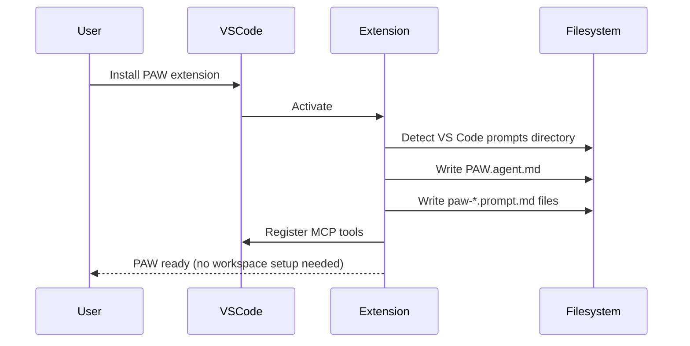
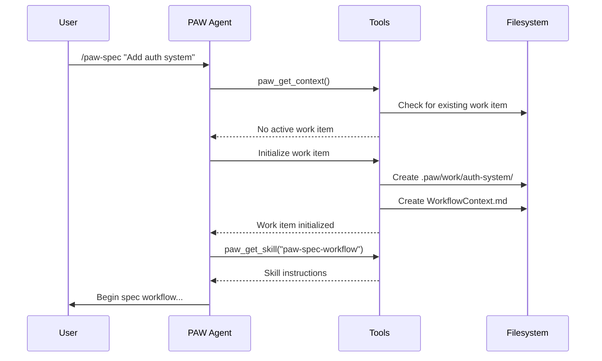

# Go-Do 3: Install & Distribution Model

**Goal:** Define filesystem layout, paths, naming conventions, and precedence rules for v2  
**Status:** Draft  
**Created:** 2025-12-22  
**Dependencies:** GoDo-1 (scope), GoDo-2 (taxonomy)

---

## Scope Reminder

Per GoDo-1, **workspace install/export is deferred to post-v2**. This document focuses on:
- **System-wide PAW (default):** Single PAW agent + tools installed to user directories; skills loaded dynamically via tool calls; available in any workspace.

Future consideration (not designed here):
- Workspace export (`.github/skills/`, `.github/agents/`) for GitHub Coding Agent visibility

**Temporary workspace skills:** PAW v2 will read workspace skills from `.paw/skills/` until VS Code's native `.github/skills/` support exits experimental status and goes GA. Once GA, PAW will migrate to `.github/skills/` as the standard workspace skills location.

---

## Delivery Model

### System-Wide PAW (V2 Default)

| Component | Delivery | User Action |
|-----------|----------|-------------|
| PAW Agent | Extension installs to VS Code user prompts dir | Install extension |
| PAW Tools | Extension registers MCP tools | Install extension |
| Built-in Skills | Bundled in extension; served via `paw_get_skill` | None (automatic) |
| User Skills | User creates in `~/.paw/skills/` | Optional customization |
| Work-Item Skills | Created in `.paw/work/<id>/skills/` | Per-project customization |
| Prompt Commands | Extension installs to VS Code user prompts dir | Install extension |
| Custom Instructions | User creates in `.paw/instructions/` or `~/.paw/instructions/` | Optional customization |

---

## Filesystem Layout

### Extension-Installed (User Level)

```
~/.vscode/
└── prompts/                              # VS Code user prompts directory
    ├── PAW.agent.md                      # Single PAW agent
    ├── paw-spec.prompt.md                # Prompt command: create spec
    ├── paw-plan.prompt.md                # Prompt command: create plan
    ├── paw-implement.prompt.md           # Prompt command: implement
    ├── paw-docs.prompt.md                # Prompt command: documentation
    ├── paw-pr.prompt.md                  # Prompt command: final PR
    ├── paw-review.prompt.md              # Prompt command: PR review
    └── paw-status.prompt.md              # Prompt command: status check
```

### User Customization (User Level)

```
~/.paw/
├── instructions/                         # User-level custom instructions
│   └── PAW-instructions.md               # Instructions for PAW agent (optional)
└── skills/                               # User-level custom skills
    └── <skill-name>/                     # Directory name = skill name
        └── SKILL.md                      # Skill definition (Agent Skills spec format)
```

### Workspace Level (Per Project)

```
<workspace>/
├── .paw/
│   ├── instructions/                     # Workspace custom instructions
│   │   └── PAW-instructions.md           # Instructions for PAW agent (optional)
│   ├── skills/                           # Workspace skills (temporary, until .github/skills/ GA)
│   │   └── <skill-name>/
│   │       └── SKILL.md
│   └── work/
│       └── <work-id>/                    # Work item directory
│           ├── WorkflowContext.md        # Central state file
│           ├── Spec.md                   # Specification artifact
│           ├── CodeResearch.md           # Code research artifact
│           ├── ImplementationPlan.md     # Plan artifact
│           ├── Docs.md                   # Documentation artifact
│           └── skills/                   # Work-item specific skills (optional)
│               └── <skill-name>/
│                   └── SKILL.md
└── .github/
    └── skills/                           # Future: VS Code native workspace skills (post-GA)
        └── <skill-name>/
            └── SKILL.md
```

### Review Workflow (Per PR)

```
<workspace>/
└── .paw/
    └── reviews/
        └── PR-<number>/                  # Review directory
            ├── ReviewContext.md          # Review state file
            ├── CodeResearch.md           # Baseline research
            ├── DerivedSpec.md            # Inferred specification
            ├── ImpactAnalysis.md         # Change impact
            ├── GapAnalysis.md            # Quality gaps
            └── ReviewComments.md         # Generated comments
```

---

## Skills Source Locations & Precedence

### Discovery Order (High → Low Priority)

| Priority | Source | Location | Purpose |
|----------|--------|----------|---------|
| 1 | Work-Item | `.paw/work/<id>/skills/<name>/SKILL.md` | Feature-specific customization |
| 2 | Workspace | `.paw/skills/<name>/SKILL.md` | Project-wide customization (temporary*) |
| 3 | User | `~/.paw/skills/<name>/SKILL.md` | Personal preferences across projects |
| 4 | Built-in | Extension bundle (via `paw_get_skill`) | PAW default behaviors |

\* *Temporary: `.paw/skills/` will be replaced by `.github/skills/` when VS Code native skills support goes GA.*

### Override Rules

- **Same-name skills:** Higher priority source overrides lower priority entirely (no merging)
- **No aliasing:** A skill's `name` field must match its directory name
- **No inheritance:** Custom skills replace, not extend, built-in skills

### Example: Override Resolution

If `paw-code-research` exists in multiple locations:
1. `.paw/work/auth-system/skills/paw-code-research/SKILL.md` → **USED**
2. `.paw/skills/paw-code-research/SKILL.md` → ignored
3. `~/.paw/skills/paw-code-research/SKILL.md` → ignored
4. Built-in `paw-code-research` → ignored

---

## Custom Instructions Precedence

Unchanged from v1; documented here for completeness.

| Priority | Source | Location |
|----------|--------|----------|
| 1 | Workspace | `.paw/instructions/PAW-instructions.md` |
| 2 | User | `~/.paw/instructions/PAW-instructions.md` |
| 3 | Default | Built into PAW agent instructions |

**Merge behavior:** Custom instructions are *appended* to defaults (unlike skills which replace).

---

## Naming Conventions

### Skills

| Rule | Requirement |
|------|-------------|
| Format | Lowercase letters, numbers, hyphens only |
| Prefix | `paw-` for built-in skills |
| Directory | Must match `name` field in SKILL.md frontmatter |
| Length | 1-64 characters (Agent Skills spec) |

**Examples:**
- ✅ `paw-spec-workflow`
- ✅ `paw-code-research`
- ✅ `my-custom-research`
- ❌ `PAW_Spec_Workflow` (uppercase, underscores)
- ❌ `paw spec workflow` (spaces)

### Prompt Commands

| Rule | Requirement |
|------|-------------|
| Format | `paw-<verb>.prompt.md` |
| Verbs | Lowercase, descriptive action |

**Examples:**
- `paw-spec.prompt.md`
- `paw-plan.prompt.md`
- `paw-implement.prompt.md`
- `paw-review.prompt.md`

### Work Item IDs

| Rule | Requirement |
|------|-------------|
| Format | Lowercase letters, numbers, hyphens only |
| Derivation | From feature name, issue title, or user input |
| Location | `.paw/work/<work-id>/` |

**Examples:**
- ✅ `auth-system`
- ✅ `fix-login-bug-123`
- ❌ `Auth_System` (uppercase, underscore)

---

## Tool Responsibilities

### `paw_list_skills`

Returns skill catalog from all sources with precedence applied.

**Output Format:** TBD — could be JSON, YAML, or markdown table. Decision will be based on clarity for the agent + minimizing token count.

**Output Schema (illustrative):**
```typescript
interface SkillCatalog {
  skills: SkillMetadata[];
}

interface SkillMetadata {
  id: string;           // e.g., "paw-spec-workflow"
  name: string;         // Human-readable name
  description: string;  // Brief description
  type: "workflow" | "capability" | "cross-cutting" | "utility";
  source: "builtin" | "workspace" | "work-item" | "user";
  path: string;         // Resolved path to SKILL.md
}
```

**Example Response:**
```json
{
  "skills": [
    {
      "id": "paw-spec-workflow",
      "name": "Specification Workflow",
      "description": "Convert feature briefs into structured specifications",
      "type": "workflow",
      "source": "builtin",
      "path": "builtin://paw-spec-workflow"
    },
    {
      "id": "paw-code-research",
      "name": "Code Research",
      "description": "Document implementation with file:line references",
      "type": "capability",
      "source": "work-item",
      "path": "/workspace/.paw/work/auth-system/skills/paw-code-research/SKILL.md"
    }
  ]
}
```

### `paw_get_skill`

Retrieves full skill content by ID.

**Input:** `{ id: string }`

**Output:** Full SKILL.md content (YAML frontmatter + instructions body)

**Resolution:** Uses `paw_list_skills` precedence to find the active skill definition.

### `paw_get_context`

Returns workflow context including:
- Active work item (from WorkflowContext.md)
- Custom instructions (merged from workspace → user → default)
- Handoff mode
- Current stage

**Note:** Skills catalog is *not* included in context response. Use `paw_list_skills` separately.

---

## Installation Flow

### Extension Install (First Time)



### Starting a Work Item



---

## Version Management

### Extension Updates

When extension updates:
1. **Agent file:** Overwritten (user customization via instructions, not agent file)
2. **Prompt commands:** Overwritten (stable interface)
3. **Built-in skills:** Updated in extension bundle (served via tool)
4. **User/workspace skills:** Untouched

### Skill Versioning (Future Consideration)

Not required for v2, but the schema supports it:
```yaml
---
name: paw-spec-workflow
version: 2.0.0
paw-version: ">=2.0.0"  # Compatibility constraint
---
```

---

## Platform Detection

Reuse existing platform detection from v1:

| Platform | VS Code Prompts Directory |
|----------|--------------------------|
| macOS | `~/Library/Application Support/Code/User/prompts/` |
| Linux | `~/.config/Code/User/prompts/` |
| Windows | `%APPDATA%\Code\User\prompts\` |

**Insider builds:** Replace `Code` with `Code - Insiders`

---

## Validation Checklist

- [ ] Single agent file installs to correct location per platform
- [ ] Prompt commands install alongside agent
- [ ] `paw_list_skills` discovers from all 4 sources
- [ ] Precedence: work-item > workspace > user > built-in
- [ ] `paw_get_skill` returns correct skill based on precedence
- [ ] Custom instructions merge correctly (append, not replace)
- [ ] Work item creation follows naming conventions
- [ ] Extension update preserves user/workspace customizations

---

## Open Questions (for later Go-Dos)

1. **Skill validation:** Should `paw_list_skills` validate SKILL.md format, or fail silently on malformed files?
2. **Catalog caching:** Cache skill catalog for performance, or always scan on each call?
3. **Skill dependencies:** Can a custom skill declare dependencies on built-in skills?
4. **Discovery notifications:** Should extension watch for new skills and notify user?

---

## References

- [GoDo-1: Scope & Non-Goals](GoDo-1_v2-scope-and-non-goals.md)
- [GoDo-2: Control Plane Taxonomy](GoDo-2_v2-control-plane-taxonomy.md)
- [Agent Skills Specification](https://agentskills.io/specification)
- [VS Code Skills Support](https://code.visualstudio.com/docs/copilot/customization/agent-skills)
